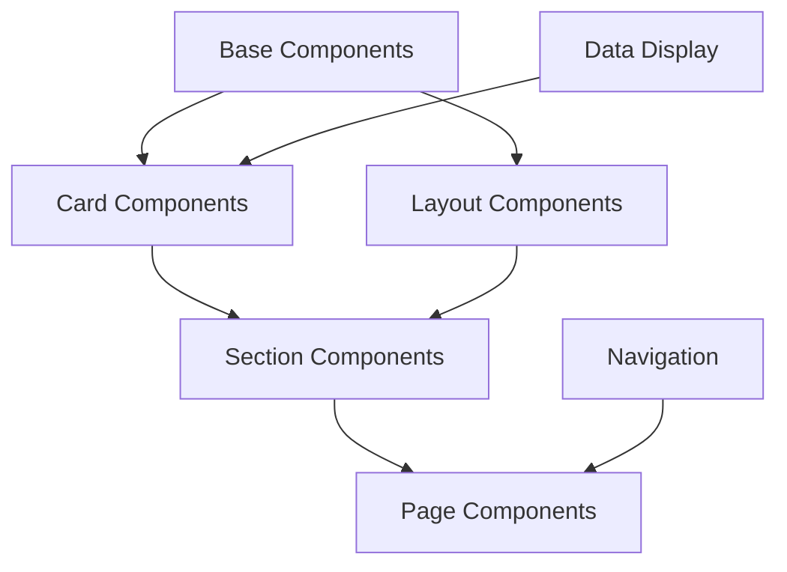

# Brain Garden Sales Pitch Component Creation Guide

## Table of Contents
- [Overview](#overview)
- [Project Structure](#project-structure)
- [Atomic Design System](#atomic-design-system)
- [Component Library Setup](#component-library-setup)
- [Base Components](#base-components)
- [Card Components](#card-components)
- [Layout Components](#layout-components)
- [Data Display Components](#data-display-components)
- [Navigation Components](#navigation-components)
- [Animation System](#animation-system)
- [Storybook Setup](#storybook-setup)
- [Integration Stories](#integration-stories)
- [Page Assembly](#page-assembly)
 
## Overview

This document serves as a comprehensive guide for creating the React component library for the Brain Garden sales pitch. Follow these tasks in order, checking them off as you complete them.

### Content Sources
All component specifications can be found in these files:
- [Enterprise Journey](sections/05-real-world-impact/enterprise-journey/index.md)
- [Core Problems](sections/05-real-world-impact/core-problems/index.md)
- [Solutions Impact](sections/05-real-world-impact/solutions-impact/index.md)

## Project Structure

- [ ] Create the following directory structure:
```
src/
  shared-components/     # Atomic design pattern structure
    atoms/              # Basic building blocks (wrapped Mantine components)
    molecules/          # Combinations of atoms
    organisms/          # Complex components
    templates/          # Page-level layouts
    utils/             # Shared utilities and hooks
  components/          # Project-specific components
    base/              # Base UI components
    cards/             # Card-based components
    layout/            # Layout components
    data/             # Data display components
    navigation/        # Navigation components
  stories/            # Storybook stories
  styles/             # Global styles and themes
  types/              # TypeScript interfaces
  utils/              # Utility functions
```

## Atomic Design System

### Atoms (Base Components)
Each atom should wrap a Mantine component and provide our custom styling and props:

```typescript
// shared-components/atoms/Button/Button.types.ts
import { ButtonProps as MantineButtonProps } from '@mantine/core';

export interface ButtonProps extends Omit<MantineButtonProps, 'variant'> {
  variant?: 'primary' | 'secondary' | 'ghost';
  size?: 'sm' | 'md' | 'lg';
}

// shared-components/atoms/Button/Button.styles.ts
import styled from 'styled-components';
import { Button as MantineButton } from '@mantine/core';

export const StyledButton = styled(MantineButton)<ButtonProps>`
  ${({ variant, theme }) => variantStyles[variant](theme)}
  ${({ size }) => sizeStyles[size]}
`;

// shared-components/atoms/Button/Button.tsx
import { ButtonProps } from './Button.types';
import * as S from './Button.styles';

export const Button: React.FC<ButtonProps> = (props) => {
  return <S.StyledButton {...props} />;
};
```

### Molecules
Combine atoms into more complex components:

```typescript
// shared-components/molecules/CardHeader/CardHeader.tsx
import { Stack } from '../atoms/Stack';
import { Typography } from '../atoms/Typography';
import { Icon } from '../atoms/Icon';

export const CardHeader: React.FC<CardHeaderProps> = ({
  title,
  subtitle,
  icon,
}) => (
  <Stack spacing="xs">
    {icon && <Icon name={icon} size={24} />}
    <Typography.H3>{title}</Typography.H3>
    {subtitle && <Typography.Body>{subtitle}</Typography.Body>}
  </Stack>
);
```

### Organisms
Create complex components from molecules and atoms:

```typescript
// shared-components/organisms/FeatureCard/FeatureCard.tsx
import { motion } from 'framer-motion';
import { CardHeader } from '../../molecules/CardHeader';
import { Button } from '../../atoms/Button';
import * as S from './FeatureCard.styles';

export const FeatureCard: React.FC<FeatureCardProps> = ({
  title,
  subtitle,
  icon,
  features,
  ctaText,
  onCtaClick,
}) => {
  return (
    <motion.div
      whileHover={{ scale: 1.02 }}
      transition={{ type: "spring", stiffness: 300 }}
    >
      <S.Card>
        <CardHeader title={title} subtitle={subtitle} icon={icon} />
        <S.FeatureList>
          {features.map((feature, index) => (
            <motion.div
              key={index}
              initial={{ opacity: 0, y: 20 }}
              animate={{ opacity: 1, y: 0 }}
              transition={{ delay: index * 0.1 }}
            >
              <S.Feature>{feature}</S.Feature>
            </motion.div>
          ))}
        </S.FeatureList>
        <Button variant="primary" onClick={onCtaClick}>
          {ctaText}
        </Button>
      </S.Card>
    </motion.div>
  );
};
```

## Component Library Setup

### Initial Setup
- [ ] Initialize a new React project with TypeScript
- [ ] Install required dependencies:
  ```bash
  # Core dependencies
  pnpm add styled-components @mantine/core @mantine/hooks framer-motion react-intersection-observer

  # Icon libraries
  pnpm add @tabler/icons-react phosphor-react lucide-react

  # Development dependencies
  pnpm add -D @types/styled-components @storybook/react @storybook/addon-essentials @types/react
  ```

### Mobile-First Design System

#### Responsive Mixins
```typescript
// styles/responsive.ts
export const breakpoints = {
  xs: '320px',
  sm: '576px',
  md: '768px',
  lg: '992px',
  xl: '1200px',
};

export const media = {
  up: (size: keyof typeof breakpoints) => `@media (min-width: ${breakpoints[size]})`,
  down: (size: keyof typeof breakpoints) => `@media (max-width: ${breakpoints[size]})`,
};

// Usage in styled components
const ResponsiveComponent = styled.div`
  padding: 1rem;  // Mobile first
  
  ${media.up('md')} {
    padding: 2rem;  // Tablet and up
  }
  
  ${media.up('lg')} {
    padding: 3rem;  // Desktop and up
  }
`;
```

## Animation System

### Framer Motion Patterns

#### Animation Variants
```typescript
// utils/animations/variants.ts
export const fadeInUp = {
  hidden: { opacity: 0, y: 20 },
  visible: { 
    opacity: 1, 
    y: 0,
    transition: {
      type: "spring",
      stiffness: 300,
      damping: 30
    }
  }
};

export const staggerContainer = {
  hidden: { opacity: 0 },
  visible: {
    opacity: 1,
    transition: {
      staggerChildren: 0.2
    }
  }
};
```

#### Animation Hooks
```typescript
// utils/animations/hooks.ts
import { useInView } from 'react-intersection-observer';
import { useAnimation, AnimationControls } from 'framer-motion';

export const useScrollAnimation = (): [any, AnimationControls] => {
  const controls = useAnimation();
  const [ref, inView] = useInView({
    threshold: 0.2,
    triggerOnce: true
  });

  React.useEffect(() => {
    if (inView) {
      controls.start('visible');
    }
  }, [controls, inView]);

  return [ref, controls];
};
```

## Base Components

### Shared Styled Components
- [ ] Create base styled components:
```typescript
// components/base/shared.styles.ts
import styled from 'styled-components';
import { Container, Text } from '@mantine/core';

export const PageSection = styled(Container)`
  margin: 2rem 0;
  width: 100%;
`;

export const GradientText = styled(Text)`
  background: ${({ theme }) => theme.colors.gradient.primary};
  -webkit-background-clip: text;
  -webkit-text-fill-color: transparent;
`;
```

### Typography System
- [ ] Create typography components using Mantine:
```typescript
// components/base/Typography/Typography.styles.ts
import styled from 'styled-components';
import { Title, Text } from '@mantine/core';

export const H1 = styled(Title)`
  font-size: 3rem;
  font-weight: 700;
  // ... other styles
`;

export const Body = styled(Text)`
  line-height: 1.6;
  // ... other styles
`;

// components/base/Typography/Typography.tsx
import * as S from './Typography.styles';

export const Typography = {
  H1: S.H1,
  H2: S.H2,
  H3: S.H3,
  Body: S.Body,
  Lead: S.Lead,
  Quote: S.Quote,
};
```

### Animation Hooks
- [ ] Create reusable animation hooks:
```typescript
// utils/animations.ts
export const useScrollAnimation = () => {
  // Implementation for scroll-based animations
};
```

## Card Components

### Completed Components
- [x] Hero (with animations and subtitle support)
- [x] QuoteGrid (with responsive layout, animations, and theme support)
- [x] ProblemOverview (with metrics display, animations, and responsive layout)

### Next Components to Create
- [ ] ChallengeBreakdown
  - Purpose: Display detailed challenge information with key issues and impacts
  - Features:
    - Title and description
    - Key issues list with titles, descriptions, and impacts
    - Accent or gradient card style
    - Position variants (left, right, full-width)
    - Animation on scroll

### Component Types to Create
Each component should have its own directory with:
- Component file (TSX)
- Types file (TS)
- Styles file (TS)
- Story file (TSX)

- [ ] Create these card components:
  - [x] ProblemOverview (Completed)
  - [ ] ChallengeBreakdown (Next up)
  - [ ] SolutionBreakdown
  - [ ] CaseStudy
  - [ ] FeatureCard
  - [ ] MetricsCard
  - [ ] ProcessCard
  - [ ] ImpactCard

Example structure for ProblemOverview:
```typescript
// components/cards/ProblemOverview/types.ts
export interface ProblemOverviewProps {
  title: string;
  description: string;
  metrics: Array<{
    number: string;
    label: string;
    prefix?: string;
    suffix?: string;
    animation?: 'count-up' | 'fade-in';
  }>;
  style?: 'gradient-card' | 'accent-card';
  position?: 'left' | 'right' | 'full-width';
  animation?: 'fade-up' | 'slide-in' | 'none';
}

// Suggested folder structure:
src/shared-components/organisms/ProblemOverview/
  ├── ProblemOverview.tsx
  ├── ProblemOverview.types.ts
  ├── ProblemOverview.styles.ts
  └── ProblemOverview.stories.tsx
```

### Implementation Guidelines for ProblemOverview
1. Use the same theme system as QuoteGrid
2. Implement responsive design from mobile-first
3. Use Framer Motion for animations
4. Support dark/light mode
5. Include gradient option
6. Add metric animations
7. Ensure accessibility
8. Add proper TypeScript types
9. Create comprehensive stories

## Layout Components

### Section Components
- [ ] Create section layout components:
```typescript
// components/layout/Section.tsx
export interface SectionProps {
  background?: 'gradient' | 'solid';
  textColor?: 'light' | 'dark';
  children: React.ReactNode;
}
```

### Grid System
- [ ] Create flexible grid components:
```typescript
// components/layout/Grid.tsx
export interface GridProps {
  columns?: number;
  gap?: string;
  children: React.ReactNode;
}
```

## Data Display Components

### Chart Components
- [ ] Create data visualization components:
  - [ ] MetricsGrid
  - [ ] ComparisonChart
  - [ ] Timeline
  - [ ] ProcessFlow

Example implementation:
```typescript
// components/data/MetricsGrid/types.ts
export interface MetricsGridProps {
  metrics: Array<{
    number: string;
    label: string;
    icon?: string;
  }>;
  columns?: 2 | 3 | 4;
  animation?: 'count-up' | 'fade-in';
}
```

## Navigation Components

### NavigationMenu Component
- [x] Create NavigationMenu component
  - [x] Implement sticky sidebar navigation
  - [x] Add smooth scroll functionality
  - [x] Support nested menu items
  - [x] Create Storybook stories
  - [x] Add mobile-responsive drawer mode
  - [x] Support light/dark themes
  - [x] Add hover and active states
  - [x] Implement keyboard navigation

### NavigationCard Component
- [x] Create NavigationCard component
  - [x] Implement gradient and accent style variants
  - [x] Add hover animations and transitions
  - [x] Support icons and call-to-action buttons
  - [x] Create Storybook stories with examples

## Storybook Setup

### Basic Setup
- [ ] Initialize Storybook:
```bash
pnpm dlx storybook init
```

### Story Structure
- [ ] Create story template:
```typescript
// .storybook/story-template.tsx
import type { Meta, StoryObj } from '@storybook/react';

const meta: Meta<typeof Component> = {
  title: 'Components/Category/ComponentName',
  component: Component,
  parameters: {
    layout: 'centered',
  },
  argTypes: {
    // Define control types
  },
};

export default meta;
```

## Integration Stories

### Full Page Story
- [ ] Create a story that shows all components together:
```typescript
// stories/pages/FullSalesPitch.stories.tsx
export const FullPage: Story = {
  render: () => (
    <Layout>
      <SideNav />
      <MainContent>
        {/* Include all sections */}
      </MainContent>
    </Layout>
  ),
};
```

### Section Stories
- [ ] Create individual section stories:
  - [ ] Enterprise Journey
  - [ ] Core Problems
  - [ ] Solutions Impact

## Page Assembly

### Content Integration
- [ ] Create content files for each section:
```typescript
// content/enterprise-journey.ts
export const enterpriseJourneyContent = {
  title: "Enterprise Journey: From Skepticism to Success",
  // ... rest of the content
};
```

### Page Components
- [ ] Create page components that use the content:
```typescript
// pages/EnterpriseJourney.tsx
export const EnterpriseJourney = () => {
  return (
    <Section>
      <Typography.H1>{content.title}</Typography.H1>
      {/* Rest of the components */}
    </Section>
  );
};
```

## Final Checklist

### Component Implementation
- [ ] All base components created
- [ ] All card components created
- [ ] All layout components created
- [ ] All data display components created
- [ ] All navigation components created

### Storybook
- [ ] Individual component stories
- [ ] Section stories
- [ ] Full page story
- [ ] Documentation added
- [ ] Controls working
- [ ] Responsive testing

### Integration
- [ ] Side navigation working
- [ ] Smooth scroll implemented
- [ ] All animations working
- [ ] Responsive layout working
- [ ] Performance optimized

### Testing
- [ ] Component tests written
- [ ] Integration tests written
- [ ] Accessibility tests passed
- [ ] Performance tests passed

## Notes for Implementation

1. Use CSS-in-JS with Emotion for styling
2. Implement responsive design from the start
3. Use Framer Motion for animations
4. Ensure accessibility compliance
5. Optimize for performance
6. Follow TypeScript best practices
7. Document all components thoroughly

## Component Dependencies Map



Remember to:
1. Start with base components
2. Build up to more complex components
3. Create stories as you go
4. Test each component thoroughly
5. Document everything
6. Consider edge cases
7. Optimize performance
8. Ensure accessibility 

## Additional Notes

### Mobile-First Guidelines
1. Start with mobile layout first
2. Use relative units (rem, em) for spacing and typography
3. Implement touch-friendly interactions (minimum 44x44px touch targets)
4. Test on various screen sizes and orientations
5. Optimize performance for mobile devices
6. Consider network conditions and lazy loading
7. Use appropriate gesture handling
8. Ensure text remains readable on small screens

### Animation Best Practices
1. Use spring animations for natural feel
2. Implement reduced motion preferences
3. Avoid heavy animations on mobile
4. Use stagger effects for lists
5. Animate on mount and scroll
6. Keep animations subtle and purposeful
7. Use consistent timing and easing
8. Consider performance impact

### Atomic Design Best Practices
1. Always wrap Mantine components as atoms
2. Keep atoms pure and simple
3. Build complexity through composition
4. Maintain consistent props API
5. Document component hierarchy
6. Use TypeScript for better maintainability
7. Create meaningful interfaces
8. Follow single responsibility principle

### Mantine Usage Guidelines
1. Use Mantine components as base building blocks
2. Extend Mantine components with styled-components when needed
3. Use Mantine hooks for functionality (useMediaQuery, useViewportSize, etc.)
4. Use Mantine theme for consistent spacing and breakpoints

### Styled Components Best Practices
1. Keep styled components in separate .styles.ts files
2. Use theme values instead of hardcoded values
3. Use props interface for dynamic styles
4. Use composition over inheritance

### Component Organization
```
src/
  components/
    base/
      shared.styles.ts     # Shared styled components
      Typography/
        index.ts
        Typography.tsx
        Typography.styles.ts
        Typography.types.ts
        Typography.stories.tsx
    cards/
      ProblemOverview/
        index.ts
        ProblemOverview.tsx
        ProblemOverview.styles.ts
        ProblemOverview.types.ts
        ProblemOverview.stories.tsx
```

### Image Optimization Guidelines
1. Use `next-image-export-optimizer` for all images
2. Implement lazy loading for off-screen images
3. Provide proper width and height to prevent layout shift
4. Use blur placeholder for large images
5. Enable zoom functionality for technical diagrams

### Icon Usage Guidelines
1. Use Tabler icons as primary icon set
2. Use Phosphor icons for technical/development concepts
3. Use Lucide icons for user interface elements
4. Maintain consistent icon sizes within contexts

### Performance Optimization
1. Implement code splitting for large components
2. Lazy load off-screen images and components
3. Use proper image formats (WebP with fallbacks)
4. Optimize animation performance
5. Monitor bundle size

### Accessibility Enhancements
1. Implement keyboard navigation
2. Add ARIA labels to interactive elements
3. Ensure proper color contrast
4. Provide text alternatives for visual content
5. Support reduced motion preferences

[Rest of the content remains the same...] 