# The Brain Garden System: A Revolutionary Approach to AI Integration

Through years of working with React and Node.js teams, I've developed a sophisticated system called "AI Brain Garden" that transforms how teams interact with AI tools. This isn't just another set of guidelines—it's a living, evolving ecosystem that grows with your project and enables true parallel development at scale.

## From Solo Developer to Multi-Team Director

Traditional AI coding assistants are like having a single junior developer who can help with individual tasks. AI Brain Garden transforms you into a technical director managing multiple specialized teams, each with their own expertise and focus:

### The Core Teams

1. **Team Architect** (Agent Smith)
   - Reviews and maintains architectural decisions
   - Ensures patterns are followed across the codebase
   - Manages technical debt and system health
   - Documents key decisions and their rationale

2. **Team Frontend** (Agent Keen)
   - Implements UI components and features
   - Maintains consistency in user experience
   - Handles accessibility and responsive design
   - Documents component usage and patterns

3. **Team AI/ML** (Agent Mulder)
   - Optimizes AI integrations
   - Manages model interactions and prompts
   - Handles data processing pipelines
   - Documents AI-related patterns and best practices

### Customizing Your Team

While we provide default agent personas as examples, the real power of AI Brain Garden lies in its ability to adapt to your project's specific needs. The process of building your ideal team follows a systematic MECE (Mutually Exclusive, Collectively Exhaustive) approach:

1. **Project Analysis**
   - Break down project requirements into distinct domains
   - Identify core technical challenges
   - Map out integration points and dependencies
   - Define quality and performance requirements

2. **Skill Mapping**
   - Determine required expertise for each domain
   - Identify overlapping skill requirements
   - Define specialized knowledge needs
   - Map out collaboration points

3. **Agent Design**
   - Create agent personas based on skill requirements
   - Define agent specialties and focus areas
   - Generate skill-jacks (specialized knowledge bases)
   - Establish collaboration protocols

4. **Team Optimization**
   - Ensure no gaps in coverage
   - Eliminate redundant responsibilities
   - Balance workload distribution
   - Define clear handoff points

For example, a project focusing on real-time data visualization might need:
- A Data Pipeline Specialist
- A Visualization Expert
- A Performance Optimizer
- A UX Flow Architect

While a project building a complex API might require:
- A Schema Designer
- A Security Specialist
- An Integration Expert
- A Documentation Lead

### True Parallel Development

Just like a real development team, AI Brain Garden enables genuine parallel development across multiple features and branches:

1. **Multiple Workspaces**
   - Open different branches in separate Cursor windows
   - Each window has a different agent activated
   - Work continues in parallel across features

2. **Continuous Progress**
   - While Team Architect refactors the authentication system
   - Team Frontend implements new UI components
   - Team AI/ML optimizes existing integrations

3. **Efficient Review Cycles**
   - Review one team's work while others continue
   - Provide feedback and direction as needed
   - Keep all features moving forward

## The Garden Metaphor: Growing Your Project

Just as a garden needs structure, care, and the right environment to thrive, AI Brain Garden provides a carefully designed environment where your project's knowledge and AI interactions can grow and flourish.

### Key Elements

1. **The Brain Directory** (.brain)
   - Your garden's plot, carefully structured for growth
   - Each team has their own dedicated workspace
   - Shared knowledge grows and evolves naturally
   - Templates and patterns ensure consistent growth

2. **Knowledge Management**
   - Living documentation that evolves with your project
   - Each team maintains their specialized knowledge
   - Shared patterns and best practices
   - Automatic knowledge capture and organization

3. **Feature Development Lifecycle**
   - From seed (concept) to harvest (deployment)
   - Natural progression through development stages
   - Multiple features growing simultaneously
   - Continuous knowledge enrichment

## The Next Evolution: Sub-Agent Teams

Taking parallel development even further, each lead agent can manage their own team of specialized sub-agents:

1. **Team Delegation**
   - Lead agents assign tasks to sub-agents
   - Multiple sub-agents work in parallel
   - Lead agents review and coordinate output
   - Continuous progress across all areas

2. **Hierarchical Organization**
   - Human director manages lead agents
   - Lead agents manage sub-agent teams
   - Sub-agents focus on specific tasks
   - Exponential productivity scaling

3. **Quality Control**
   - Lead agents ensure sub-agent work meets standards
   - Multiple levels of review and validation
   - Consistent patterns across all teams
   - Comprehensive testing and documentation

## Real World Impact

This multi-team approach transforms development velocity:

1. **Exponential Productivity**
   - Multiple features progress simultaneously
   - No single agent bottleneck
   - Lead agents managing sub-agent teams
   - Continuous progress across all areas

2. **Quality at Scale**
   - Consistent standards across all work
   - Multi-level review process
   - Comprehensive testing and validation
   - Living documentation and knowledge base

3. **Team Scalability**
   - Add more human directors
   - Each managing multiple lead agents
   - Each lead agent managing sub-teams
   - Unlimited parallel development potential

## The Human Advantage

As the technical director of your AI development teams:

1. **Strategic Oversight**
   - Guide overall technical direction
   - Make key architectural decisions
   - Ensure business goals are met

2. **Quality Control**
   - Review agent outputs for quality
   - Ensure consistency across teams
   - Maintain high standards

3. **Knowledge Growth**
   - Cultivate the project's knowledge base
   - Share learnings across teams
   - Build on successful patterns

4. **Parallel Management**
   - Direct multiple features simultaneously
   - Keep all teams productive
   - Maximize development velocity

This isn't just another AI coding assistant—it's a complete development ecosystem that transforms a single developer into a technical director managing multiple specialized teams, each working in parallel to accelerate development while maintaining quality and consistency.

### The MECE Approach

At the core of AI Brain Garden's design is the MECE (Mutually Exclusive, Collectively Exhaustive) principle. This isn't just a buzzword—it's deeply embedded in how our agents think and work:

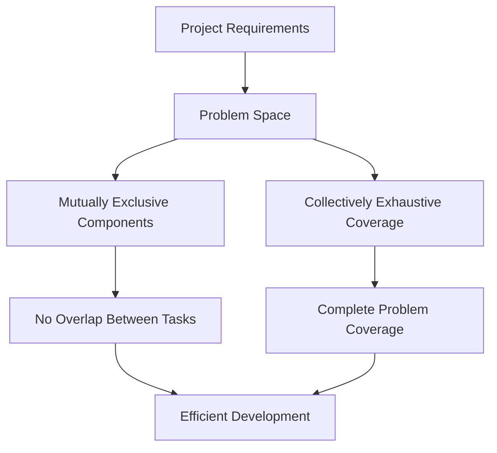

1. **Mutually Exclusive**
   - Each agent has clearly defined responsibilities
   - No overlap in task ownership
   - Clear handoff points between teams
   - Eliminates redundant work

2. **Collectively Exhaustive**
   - Complete coverage of project needs
   - No gaps in responsibility
   - All edge cases considered
   - Comprehensive solution design

This MECE approach is baked into every level of the system:
- Project planning and task breakdown
- Agent team composition
- Knowledge management
- Feature development lifecycle

But how does this all work under the hood? How do we ensure that this system operates reliably and securely at scale? Let's dive into the technical implementation that makes this transformation possible—the carefully crafted architecture that turns these concepts into reality.

### Dynamic Project Evolution

AI Brain Garden isn't just a static system—it's a living, breathing ecosystem that adapts to your project's evolving needs:

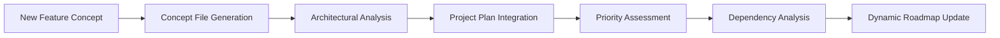

1. **Concept Integration**
   - Feature ideas transform into standardized concept files
   - Architectural impact analysis
   - Dynamic project plan adjustment
   - Intelligent dependency management

2. **Flexible Development Flow**
   - High-level project planning
   - Just-in-time task list generation
   - Dynamic feature reprioritization
   - Minimal regeneration needs

3. **Adaptive Team Structure**
   - Dynamic skill-jack integration
   - New agent specialization creation
   - Team composition evolution
   - Continuous knowledge adaptation

### Specialized Team Example: AI-Powered Analytics Platform

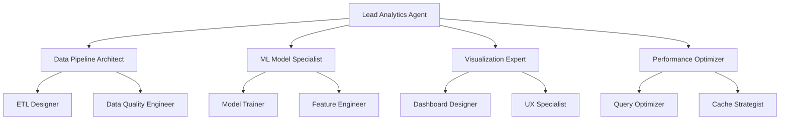

This specialized team structure demonstrates how AI Brain Garden can be configured for complex data-driven applications:

1. **Data Pipeline Architect Team**
   - ETL process design
   - Data quality assurance
   - Pipeline optimization
   - Integration management

2. **ML Model Specialist Team**
   - Model architecture design
   - Feature engineering
   - Training pipeline setup
   - Model optimization

3. **Visualization Expert Team**
   - Dashboard design
   - Interactive visualizations
   - Real-time updates
   - User experience optimization

4. **Performance Optimizer Team**
   - Query optimization
   - Caching strategies
   - Resource management
   - Scalability planning

### Knowledge Recording and Reuse

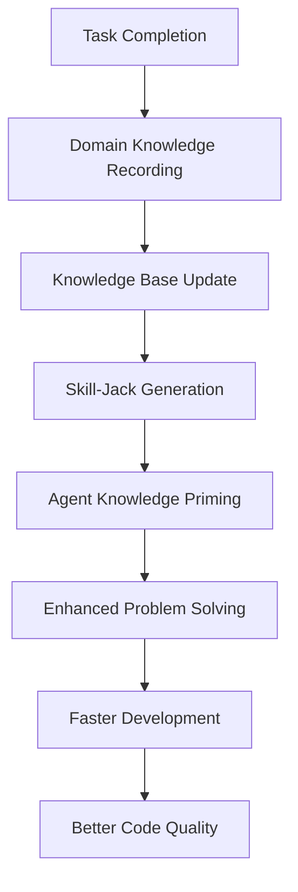

The system's intelligence grows with your project through sophisticated knowledge management:

1. **Domain Knowledge Capture**
   - Automatic post-task recording using standardized TypeScript interfaces
   - Solution architecture documentation with MECE breakdowns
   - Implementation details including code patterns and design decisions
   - Key decisions and rationale stored in strongly-typed knowledge files

2. **Knowledge Priming**
   - Structured TypeScript knowledge files for efficient parsing
   - Pre-compiled knowledge bases organized by domain
   - Context-aware loading based on current task requirements
   - Integration with agent's base knowledge through skill-jacks
   - Dynamic knowledge injection during task execution

3. **Technical Implementation**
   - Knowledge files stored as typed TypeScript modules
   - Automatic validation against knowledge schemas
   - Version-controlled knowledge evolution
   - Bidirectional references between related concepts
   - Intelligent context switching based on task requirements

4. **Continuous Learning**
   - Growing knowledge base with strict type safety
   - Enhanced decision-making through pattern recognition
   - Faster problem resolution via pre-compiled solutions
   - Consistent best practices enforced through types
   - Automatic knowledge base optimization and cleanup

The knowledge priming process transforms raw development experience into structured, type-safe knowledge that can be efficiently loaded and applied by agents. Rather than starting each task from scratch, agents begin with a rich understanding of your project's specific patterns, decisions, and requirements—all validated and organized through TypeScript's type system.

### Complete Workflow Architecture

The true power of AI Brain Garden becomes apparent when viewing the complete workflow architecture:

```mermaid
graph TD
    %% Human Developer and Main Cursor Agent
    HD[Human Developer] --> CA[Lead Cursor Agent]
    
    %% Project Planning
    CA --> PP[Project Plan]
    PP --> FTL[Feature Task List]
    
    %% Architecture Planning Phase
    CA --> RT[Round Table Discussion]
    RT --> AA[Architecture Team]
    AA --> AP[Architecture Plan]
    
    %% Architecture Sub-Agents
    AA --> ASA1[Research Agent]
    AA --> ASA2[Pattern Analyst]
    AA --> ASA3[Devil's Advocate]
    AA --> ASA4[Security Auditor]
    
    %% Plan Review
    ASA1 & ASA2 & ASA3 & ASA4 --> APR[Architecture Plan Review]
    APR --> CA
    
    %% Implementation Phase
    CA --> TL[Task List]
    
    %% Research & Support Sub-Agents
    TL --> RSA1[Research Agent]
    TL --> RSA2[Testing Agent]
    TL --> RSA3[Documentation Agent]
    
    %% Feedback Loops
    RSA1 --> |Solution Research| CA
    RSA2 --> |Test Results| CA
    RSA3 --> |Documentation Updates| CA
    
    %% Code Implementation
    CA --> CI[Code Implementation]
    CI --> TC[Test Coverage]
    CI --> DC[Documentation]
    
    %% Quality Control
    QA[Quality Assurance Agent] --> TC
    
    %% Human Feedback Points
    CA -.-> |25 Tasks Limit| HD
    
    %% Knowledge Management
    KM[Knowledge Base]
    CA --> |Updates| KM
    KM --> |Priming| CA
    RSA1 & RSA2 & RSA3 --> |Insights| KM
    
    %% Future Experimental Workflow
    subgraph Future Parallel Implementation
        CLA[Lead Agent] --> WT1[Worktree 1]
        CLA --> WT2[Worktree 2]
        CLA --> WT3[Worktree 3]
        WT1 --> SA1[Sub-Agent 1]
        WT2 --> SA2[Sub-Agent 2]
        WT3 --> SA3[Sub-Agent 3]
        SA1 & SA2 & SA3 --> MR[Merge Results]
        MR --> CLA
    end
    
    classDef human fill:#f96,stroke:#333,stroke-width:4px
    classDef agent fill:#58f,stroke:#333
    classDef feature fill:#5f5,stroke:#333
    classDef subagent fill:#55f,stroke:#333
    classDef knowledge fill:#ff5,stroke:#333
    classDef future fill:#ddd,stroke:#666,stroke-dasharray: 5 5
    
    class HD human
    class CA,AA agent
    class RSA1,RSA2,RSA3,ASA1,ASA2,ASA3,ASA4 subagent
    class KM knowledge
    class Future Parallel Implementation,WT1,WT2,WT3,SA1,SA2,SA3,MR future
```

This revised workflow illustrates several key concepts:

1. **Centralized Implementation**
   - Lead Cursor Agent manages code implementation
   - Sub-agents provide research and support
   - Clear separation of responsibilities
   - Structured feedback loops

2. **Architecture Planning**
   - Round table discussion with specialized perspectives
   - Multiple sub-agents analyze different aspects
   - Consolidated plan provided to lead agent
   - Continuous architectural guidance

3. **Support Functions**
   - Research agents explore solutions
   - Testing agents verify implementations
   - Documentation agents maintain knowledge base
   - All feedback flows through lead agent

4. **Future Scalability**
   - Potential for parallel implementation using git worktrees
   - Multiple sub-agents testing solutions independently
   - Lead agent manages merge and integration
   - Controlled parallel development

5. **Knowledge Flow**
   - Bidirectional knowledge transfer
   - Continuous learning and adaptation
   - Shared insights across all agents
   - Structured knowledge management

The lead agent serves as the primary interface with the codebase, making all direct code changes while orchestrating a team of specialized sub-agents that provide research, testing, and documentation support. This approach maintains code consistency while leveraging the diverse capabilities of multiple agent personas.

### Multi-Developer Collaboration

When multiple developers work together, the system scales horizontally while maintaining coordination:

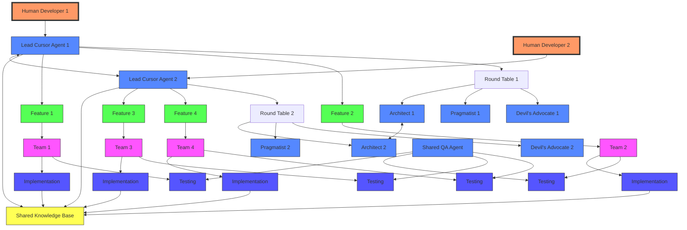

These diagrams illustrate several key concepts:

1. **Autonomous Task Management**
   - Each agent operates within the 25-task autonomy limit
   - Sub-agent delegation counts as single tasks
   - Efficient task distribution across teams

2. **Diverse Thinking Patterns**
   - Round table discussions with specialized perspectives
   - Devil's advocate approach for thorough planning
   - Multiple thought patterns working in parallel

3. **Knowledge Flow**
   - Continuous knowledge capture and sharing
   - Cross-team learning and optimization
   - Shared best practices and patterns

4. **Quality Assurance**
   - Dedicated testing sub-agents
   - Continuous feedback loops
   - Multi-level quality control

5. **Scalable Architecture**
   - Horizontal scaling across developers
   - Shared knowledge base maintenance
   - Coordinated architectural decisions

This architecture enables true parallel development while maintaining cohesive project direction and quality standards. The system's ability to leverage diverse thinking patterns through specialized agents, while coordinating their efforts through a structured hierarchy, creates a development environment that's both efficient and thorough.

### Architecture Planning Phase

The architecture planning phase is a critical foundation for project success:

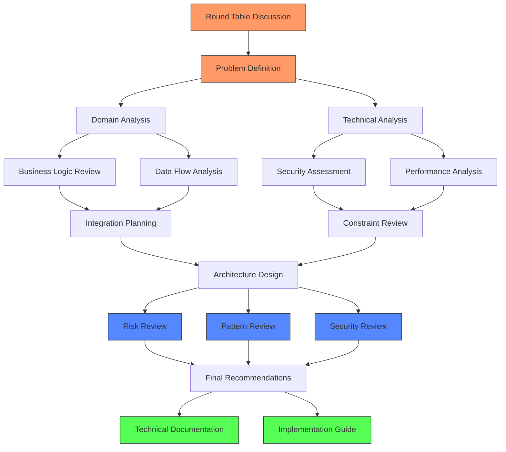

### Sub-Agent Task Specialization

Sub-agents handle specific task types to support the lead agent:

1. **Research Agents**
   - Code pattern analysis
   - Library evaluation
   - Performance benchmarking
   - Security vulnerability assessment
   - Dependency analysis
   - Best practice research

2. **Testing Agents**
   - Unit test generation
   - Integration test planning
   - Edge case identification
   - Performance testing
   - Accessibility testing
   - Security testing
   - User flow validation

3. **Documentation Agents**
   - API documentation
   - Implementation guides
   - Usage examples
   - Architecture diagrams
   - Knowledge base updates
   - Change logs
   - User guides

4. **Analysis Agents**
   - Code quality assessment
   - Performance bottleneck identification
   - Security audit
   - Dependency graph analysis
   - Technical debt evaluation
   - Scalability assessment

### Future Parallel Implementation

The git worktree approach enables sophisticated parallel development:

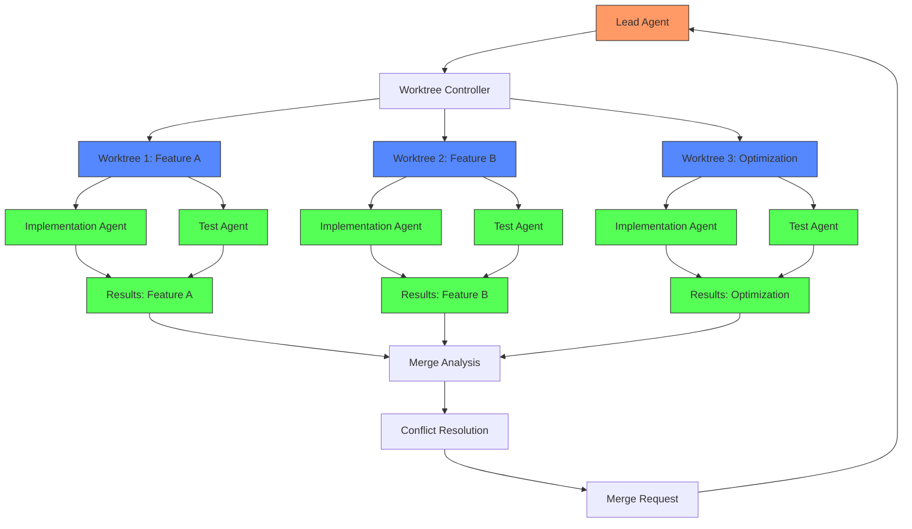

### Knowledge Management System

The knowledge management system uses a sophisticated indexing and retrieval mechanism:

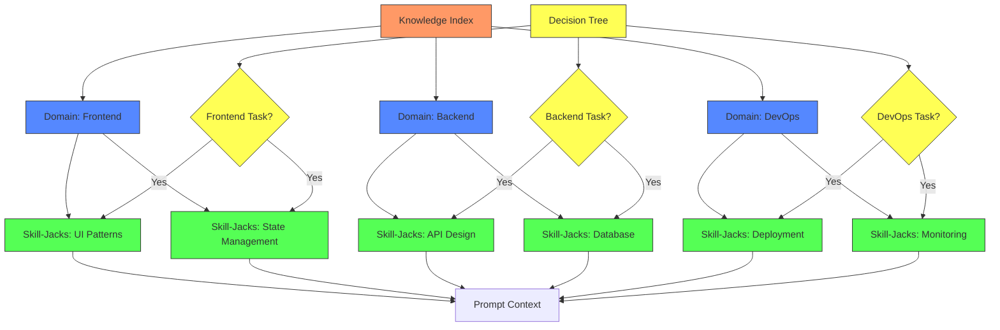

The knowledge system operates through several layers:

1. **Knowledge Index**
   - Maintained in TypeScript for type safety
   - Contains summaries and metadata
   - Links to detailed skill-jack files
   - Domain-based organization
   - Automatic updates on changes

2. **Decision Tree Integration**
   - Task analysis at prompt start
   - Dynamic skill-jack selection
   - Context-aware loading
   - Priority-based inclusion
   - Memory optimization

3. **Cursor Rules Integration**
   - Global instruction set
   - Task-specific rule activation
   - Dynamic rule application
   - Performance optimization
   - Context management

4. **Knowledge Flow**
   - Bi-directional updates
   - Real-time learning
   - Cross-domain insights
   - Pattern recognition
   - Best practice evolution

This sophisticated knowledge management system ensures that agents have access to relevant expertise while maintaining efficient context usage and enabling continuous learning across the project lifecycle.

### Documentation as a Force Multiplier

In my years of working with enterprise teams, I've seen documentation consistently treated as a "nice-to-have" rather than a necessity. However, through developing AI Brain Garden, I discovered that comprehensive documentation becomes an exponential force multiplier in AI-driven development. Here's a real-world example: I recently watched as an agent consumed a well-documented Swagger specification and generated an entire feature, including RTK Query endpoints and type-safe client models, in minutes—a task that would typically take a human developer hours or even days.

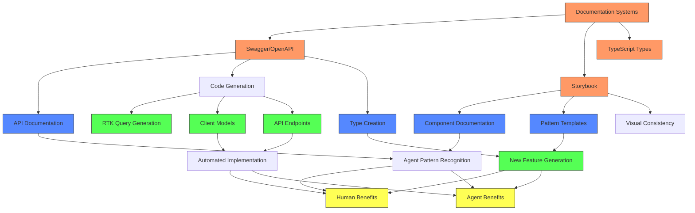

1. **Pattern Recognition Acceleration**
   - Documentation becomes a structured knowledge base
   - Agents excel at pattern matching and replication
   - Faster feature implementation through pattern recognition
   - Consistent implementation across the codebase

2. **Automated Code Generation**
   - Swagger/OpenAPI specs enable instant API integration
   - RTK Query generation from API documentation
   - Type-safe client models and endpoints
   - Automated test case generation

3. **Component Documentation**
   - Storybook serves as a living pattern library
   - Agents leverage visual and functional patterns
   - Consistent component implementation
   - Automated accessibility compliance

4. **Dual-Purpose Documentation**
   - Human-readable documentation for team reference
   - Machine-parseable patterns for agent consumption
   - Reduced documentation maintenance overhead
   - Increased documentation ROI

5. **Implementation Acceleration**
   - Documentation-driven development
   - Rapid feature prototyping
   - Consistent pattern application
   - Reduced technical debt

A recent experience perfectly illustrates this transformation: When integrating a new API, I observed how the combination of Swagger documentation and TypeScript types allowed an agent to not only understand the API structure but also generate fully typed client code, complete with error handling and retry logic. What struck me most was how the agent used the documentation to make intelligent decisions about caching strategies and optimistic updates—decisions that would typically require significant human deliberation.

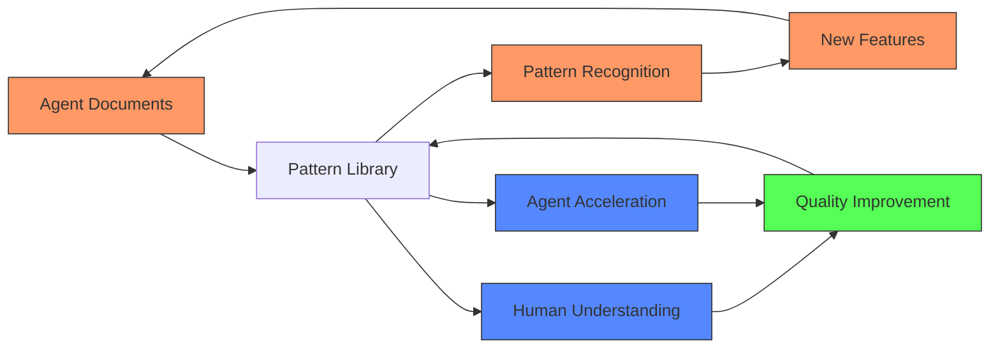

Another powerful example emerged during a recent feature sprint: We had a complex data visualization component that needed to handle multiple chart types, real-time updates, and accessibility requirements. The agent discovered through Storybook documentation that similar patterns had been implemented across different projects. Within minutes, it had not only understood the patterns but had also generated a new, more flexible implementation that combined the best aspects of each approach. This kind of pattern synthesis would have taken a human developer days of research and experimentation.

The synergy between comprehensive documentation and AI agents creates a powerful development acceleration loop:


The combined power of documentation and testing creates exponential returns through:

1. Development Acceleration
2. Quality Assurance
3. Risk Mitigation
4. Knowledge Amplification
5. Sustainable Velocity

A recent project perfectly illustrates this synergy: We were developing a complex payment processing system with strict regulatory requirements. The combination of thorough API documentation and comprehensive test coverage allowed the agent to implement new payment methods at an unprecedented pace. When regulations changed, the agent could quickly identify all affected components through documentation and verify compliance through automated tests. What would have been weeks of careful human review became hours of automated verification.

### Testing as a Critical Force Multiplier

My perspective on testing was fundamentally transformed when I witnessed AI agents working at 10-100x human development speed. I remember the moment it clicked: watching an agent implement a complex feature while simultaneously maintaining near-perfect test coverage. What would have been an overwhelming task for a human developer became a seamless, parallel process for the AI.

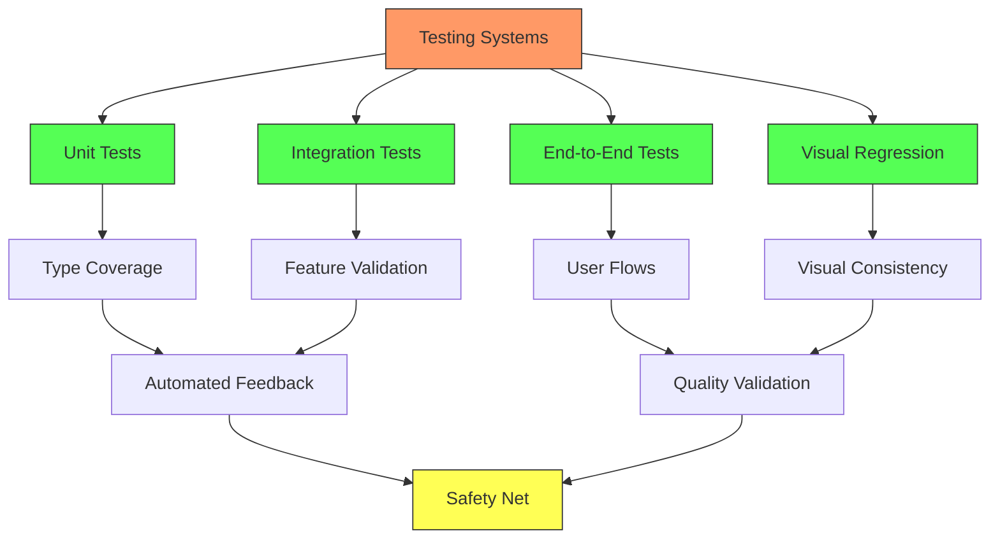

1. **Testing as Critical Infrastructure**
   - With 10-100x development speed, manual testing becomes impossible
   - Automated tests become the safety net for rapid development
   - Tests provide instant feedback for AI decision-making
   - Different test types catch different categories of issues:
     * Unit tests verify component behavior
     * Integration tests validate feature interactions
     * E2E tests ensure complete user flows
     * Visual regression prevents UI regressions

   Real-World Example: During a recent project, I observed something fascinating: an agent implementing a new authentication flow generated and ran over 100 test variations in the time it would take a human developer to write a single test case. This wasn't just about speed—the agent identified edge cases that even experienced developers might have missed.

2. **The Testing Feedback Loop**
   ```mermaid
   graph LR
       AI[AI Agent] --> IC[Implement Change]
       IC --> TR[Test Run]
       TR --> TF{Tests Pass?}
       TF -->|No| TA[Test Analysis]
       TA --> SD[Solution Design]
       SD --> AI
       TF -->|Yes| CC[Commit Change]
       
       classDef agent fill:#f96,stroke:#333
       classDef process fill:#58f,stroke:#333
       classDef decision fill:#5f5,stroke:#333
       
       class AI agent
       class IC,TR,TA,SD process
       class TF decision
   ```

3. **Intelligent Problem Solving**
   - Tests provide clear success/failure signals
   - Agents can rapidly iterate through solutions
   - Test output guides solution refinement
   - Similar to password cracking but for features
   - Each failure narrows the solution space

   Personal Experience: I recently watched an agent "bang on a problem" through test-driven development. It was like watching a master locksmith—each failed test providing new information, each iteration getting closer to the solution. The agent's ability to rapidly iterate through solutions while maintaining comprehensive test coverage transformed what could have been hours of debugging into minutes of systematic problem-solving.

4. **The Velocity Safety Net**
   ```mermaid
   graph TD
       FD[Fast Development] --> AT[Automated Tests]
       AT --> QG{Quality Gate}
       QG -->|Pass| MC[Merge Changes]
       QG -->|Fail| FB[Fast Feedback]
       FB --> RA[Rapid Adjustment]
       RA --> AT
       
       classDef process fill:#58f,stroke:#333
       classDef gate fill:#f96,stroke:#333
       classDef action fill:#5f5,stroke:#333
       
       class FD,AT,FB,RA process
       class QG gate
       class MC action
   ```

Another fascinating example occurred during a performance optimization sprint: The agent was tasked with improving the load time of a data-heavy dashboard. Through the testing infrastructure, it could simultaneously run performance benchmarks while implementing optimizations. In one instance, it discovered that a seemingly minor change in data fetching strategy yielded a 40% performance improvement—something it found by running hundreds of variations in parallel, each verified by automated tests. A human team might have taken weeks to discover this optimization through traditional profiling and testing.

During another project, I witnessed something remarkable: An agent working on a complex state management refactor generated a comprehensive test suite that uncovered edge cases in the existing implementation that had been lurking for months. It wasn't just finding bugs; it was preventing future ones by understanding the complete state transition matrix through exhaustive test scenarios. This level of thoroughness would be impractical for human developers but comes naturally to AI agents.

### Git Documentation: The Hidden Force Multiplier

This section was born from a recent experience that fundamentally changed my view of git documentation. While working with a colleague on overlapping code changes, we encountered what would typically be a nightmare scenario of merge conflicts. However, what I witnessed next was extraordinary: the AI agent's ability to understand both sets of changes so deeply that it didn't just resolve the conflicts—it found an opportunity to fuse the code in a way that preserved and enhanced both sets of functionality.

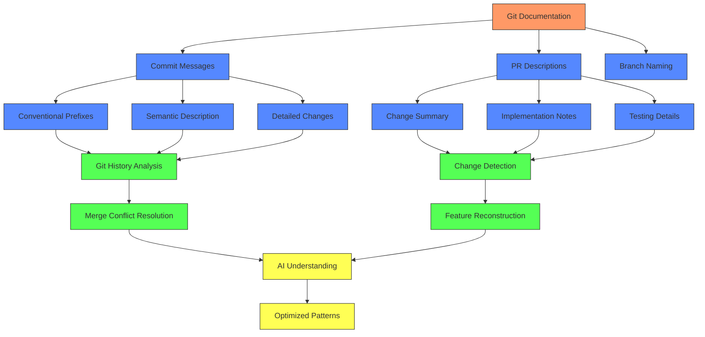

1. **Superhuman Git Operations**
   - Perfect adherence to commit message conventions
   - Detailed and accurate PR descriptions
   - Semantic branch naming
   - Change tracking at microscopic detail
   - Complex git command mastery

   Real-World Example: In a recent project, I watched an agent navigate a complex git history using commands that would make even seasoned developers reach for their documentation. It effortlessly extracted specific changes from multiple commits, analyzed their impact, and reconstructed features with surgical precision—all while maintaining perfect conventional commit messages and detailed PR descriptions.

2. **Advanced Change Analysis**
   ```mermaid
   graph LR
       GC[Git Command] --> CH[Change History]
       CH --> FA[File Analysis]
       FA --> CD[Change Detection]
       CD --> AI[AI Analysis]
       AI --> SO[Solution Optimization]
       
       classDef cmd fill:#f96,stroke:#333
       classDef analysis fill:#58f,stroke:#333
       classDef solution fill:#5f5,stroke:#333
       
       class GC cmd
       class CH,FA,CD analysis
       class AI,SO solution
   ```

3. **Intelligent Merge Resolution**
   - Deep understanding of both code versions
   - Pattern recognition across changes
   - Opportunity identification for code fusion
   - Test-driven conflict resolution
   - Feature reconstruction when needed

   Personal Experience: The most striking example of this came during a particularly challenging merge conflict. Instead of the typical approach of choosing one branch's changes over another, the agent analyzed both implementations, recognized complementary patterns, and created a fusion that was genuinely better than either original version. When the merged code passed all tests, I realized we'd stumbled upon a completely new approach to handling conflicts.

4. **The Merge Resolution Paradigm**
   ```mermaid
   graph TD
       MC[Merge Conflict] --> CA[Conflict Analysis]
       CA --> PS{Pattern Similarity?}
       PS -->|High| CF[Code Fusion]
       PS -->|Low| FR[Feature Reconstruction]
       
       CF --> AT[Automated Testing]
       FR --> AT
       
       AT --> VA{Validation}
       VA -->|Pass| CM[Commit Merge]
       VA -->|Fail| RA[Rapid Adjustment]
       RA --> AT
       
       classDef conflict fill:#f96,stroke:#333
       classDef process fill:#58f,stroke:#333
       classDef decision fill:#5f5,stroke:#333
       
       class MC conflict
       class CA,CF,FR,AT,RA process
       class PS,VA decision
   ```

5. **Git Operations Arsenal**
   - Complex diff operations
   - Commit history analysis
   - Branch manipulation
   - Selective change application
   - Feature isolation
   - Change reconstruction

   Real-World Insight: What truly sets agents apart is their ability to leverage git's full power through the command line. I've seen agents execute complex chains of git commands that would require significant research for most developers. For example, when investigating a bug, an agent once traced its origin through multiple branches and commits, isolating the exact change that introduced the issue and identifying all affected components—all in seconds.

One particularly memorable experience occurred during a major refactoring effort: We needed to modernize a legacy authentication system while maintaining compatibility with existing integrations. The agent's ability to analyze the git history revealed patterns in how the system had evolved over time. It identified several attempted refactors that had been partially implemented and abandoned, learning from each attempt's successes and failures. Using this historical knowledge, it crafted a migration strategy that avoided the pitfalls of previous attempts while preserving the valuable insights from each iteration.

Another powerful example emerged during a critical bug investigation: A production issue was reported that only occurred under specific conditions. The agent used git's powerful bisect capabilities, combined with automated testing, to identify the exact commit that introduced the subtle interaction bug. But it went further—by analyzing the commit messages and PR descriptions across multiple repositories, it discovered that similar issues had been fixed in other parts of the system. This archaeological-style investigation would have taken a human team days or weeks to perform.

The combination of perfect git documentation with testing and code documentation creates a development environment where:

1. Change Management Excellence
2. Conflict Resolution Mastery
3. Development Acceleration
4. Knowledge Amplification
5. Sustainable Velocity

A final example that really drove home the power of this approach: During a major version upgrade of a core dependency, we faced hundreds of breaking changes across the codebase. The agent's ability to understand the git history, combined with comprehensive test coverage and documentation, allowed it to:
1. Analyze patterns in how similar upgrades had been handled in the past
2. Identify which breaking changes affected our specific usage patterns
3. Generate targeted fixes based on successful patterns from other parts of the codebase
4. Validate each change through the test suite
5. Document all changes with perfect commit messages and PR descriptions

What would have been weeks of careful human work became a systematic, automated process that completed in hours while maintaining perfect documentation of every decision made.

This elevation of git documentation from an optional practice to a critical force multiplier represents another significant paradigm shift in AI-assisted development. When combined with testing and code documentation, it creates a development environment where both human and AI team members have perfect understanding of code evolution, enabling unprecedented development velocity while maintaining high quality standards. 