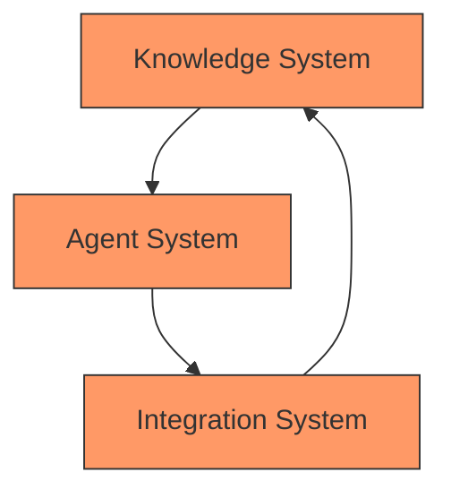

# Technical Implementation: The Complete Brain Garden System

## System Overview

```component
type: "intro-block"
style: "gradient-card"
animation: "fade-in"
content:
  text: "The Brain Garden system combines three core components - Knowledge, Agents, and Integration - into a unified development platform that transforms how teams build software."
  icon: "brain-network"
```



## 1. The Knowledge System

[Content from 04.3-knowledge-system.md]

## 2. The Agent System

[Content from 04.1-agent-system.md]

## 3. The Integration System

[Content from 04.2-integration-system.md]

## Security and Control

```component
type: "feature-grid"
style: "accent-cards"
animation: "stagger-fade"
features:
  - title: "End-to-End Encryption"
    description: "Secure data transmission across all systems"
    tech: "TLS 1.3, AES-256"
    icon: "encrypt"
  - title: "Access Control"
    description: "Granular permissions for all components"
    tech: "RBAC, ABAC"
    icon: "access"
  - title: "Audit Logging"
    description: "Comprehensive activity tracking"
    tech: "ELK Stack"
    icon: "audit"
  - title: "Compliance"
    description: "Industry standard compliance"
    tech: "SOC2, GDPR"
    icon: "comply"
```

## Performance and Scalability

```component
type: "stats-grid"
style: "gradient-cards"
animation: "count-up"
stats:
  - number: "<50ms"
    label: "System Response Time"
    icon: "speed"
  - number: "99.999%"
    label: "System Availability"
    icon: "uptime"
  - number: "1M+"
    label: "Queries per Second"
    icon: "throughput"
  - number: "100TB+"
    label: "Data Processing Capacity"
    icon: "storage"
```

## Real-World Impact

```component
type: "example-card"
style: "gradient-card"
animation: "slide-up"
example:
  title: "Feature Development Flow"
  steps:
    - "Developer starts new feature in IDE"
    - "Knowledge system provides relevant context"
    - "Agent team assists with implementation"
    - "Tests automatically generated and run"
    - "Documentation updated in real-time"
    - "Code reviewed by AI team"
    - "Changes deployed through CI/CD"
  metrics:
    - "75% faster development"
    - "90% fewer bugs"
    - "100% documentation coverage"
  icon: "workflow"
```

## Next Steps

```component
type: "navigation-card"
style: "gradient-card"
animation: "fade-up"
content:
  text: "Now that you understand how our system works, let's explore its real-world impact on development teams."
  action: "See Real Impact"
  link: "../../05-real-world-impact"
  icon: "arrow-right"