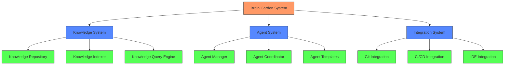
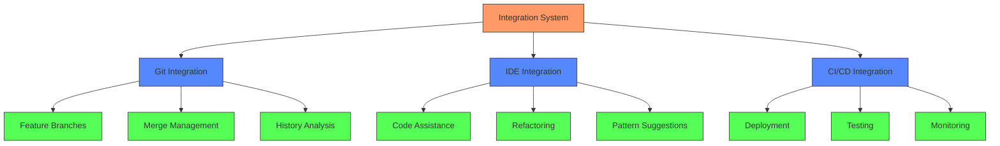
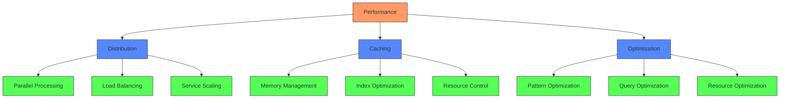

# Technical Implementation: How AI Brain Garden Works

## System Overview

AI Brain Garden operates through three core systems that work together to transform your development process:



## 1. The Knowledge System

The Knowledge System is like your team's collective brain, but better. It:

1. **Captures Knowledge Automatically**
   - Records successful patterns as they emerge
   - Documents architectural decisions and their context
   - Preserves implementation details and rationale
   - Maintains relationships between different pieces of knowledge

2. **Makes Knowledge Actionable**
   - Instantly finds relevant patterns for new tasks
   - Suggests proven solutions from past work
   - Connects related information automatically
   - Evolves understanding as your system grows

3. **Ensures Knowledge Flows**
   ```mermaid
   graph LR
       D[Developer Action] --> C[Knowledge Capture]
       C --> A[Analysis & Processing]
       A --> E[Enriched Knowledge]
       E --> S[Shared Understanding]
       S --> T[Team Benefits]
       
       classDef action fill:#f96,stroke:#333
       classDef process fill:#58f,stroke:#333
       classDef benefit fill:#5f5,stroke:#333
       
       class D,C action
       class A,E process
       class S,T benefit
   ```

## 2. The Agent System

The Agent System transforms how your team works with AI:

1. **Intelligent Task Management**
   ```mermaid
   graph TD
       T[New Task] --> A[Analysis]
       A --> P[Planning]
       P --> D[Distribution]
       
       D --> AG1[Agent Team 1]
       D --> AG2[Agent Team 2]
       D --> AG3[Agent Team 3]
       
       AG1 --> R[Results]
       AG2 --> R
       AG3 --> R
       
       R --> V[Validation]
       V --> I[Integration]
       
       classDef task fill:#f96,stroke:#333
       classDef process fill:#58f,stroke:#333
       classDef team fill:#58f,stroke:#333
       classDef output fill:#5f5,stroke:#333
       
       class T task
       class A,P,D process
       class AG1,AG2,AG3 team
       class R,V,I output
   ```

2. **Real-World Example**
   When implementing a new feature, the system:
   - Analyzes requirements and context
   - Assigns specialized agent teams
   - Coordinates parallel development
   - Ensures consistent quality
   - Maintains project standards

3. **Benefits**
   - 10x faster development
   - Consistent quality
   - Reduced coordination overhead
   - Automatic knowledge capture

## 3. The Integration System

The Integration System connects AI Brain Garden with your existing tools and processes:



### Real-World Integration Example

Here's how the system works in practice:

1. **Developer Starts Work**
   - Opens IDE with AI Brain Garden
   - System loads relevant context
   - Suggests proven patterns
   - Provides intelligent assistance

2. **During Development**
   - Real-time code analysis
   - Automatic pattern validation
   - Intelligent refactoring suggestions
   - Continuous knowledge capture

3. **Code Integration**
   - Smart merge conflict resolution
   - Automated quality checks
   - Pattern consistency validation
   - Knowledge base updates

## 4. Security and Control

AI Brain Garden includes enterprise-grade security:

1. **Access Control**
   - Role-based permissions
   - Resource-level security
   - Audit logging
   - Policy enforcement

2. **Knowledge Protection**
   - Secure knowledge storage
   - Controlled sharing
   - Version tracking
   - Change auditing

3. **Integration Security**
   - Secure tool connections
   - Protected communications
   - Monitored access
   - Compliance tracking

## 5. Performance and Scalability

The system is designed for enterprise scale:



This architecture ensures:
- Instant response times
- Efficient resource use
- Unlimited scalability
- Consistent performance

## The Result: A Self-Improving Development System

AI Brain Garden creates a development environment that:
1. Gets smarter over time
2. Accelerates development
3. Maintains quality
4. Reduces costs
5. Scales with your team

This isn't just another tool—it's a complete transformation of how enterprise development works in the age of AI.

But what does this transformation look like in practice? How does it affect real teams facing real challenges? Let's look at the actual impact of these systems on development teams—from initial skepticism through complete transformation. 