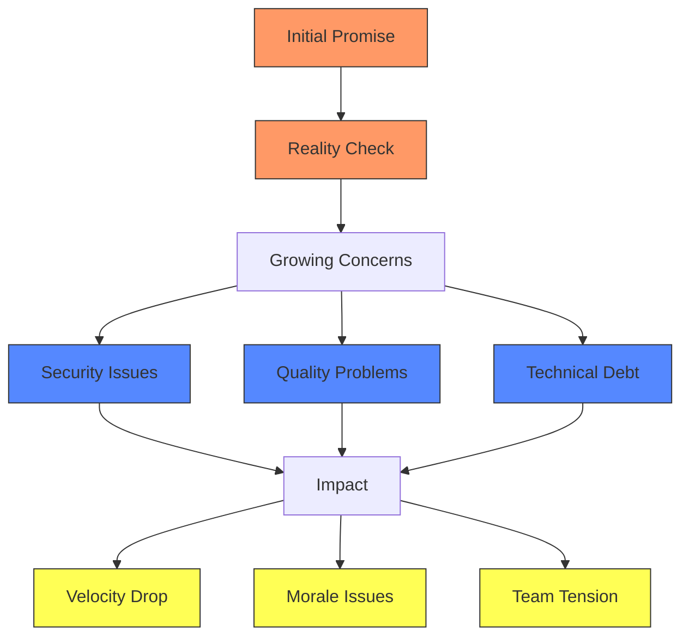
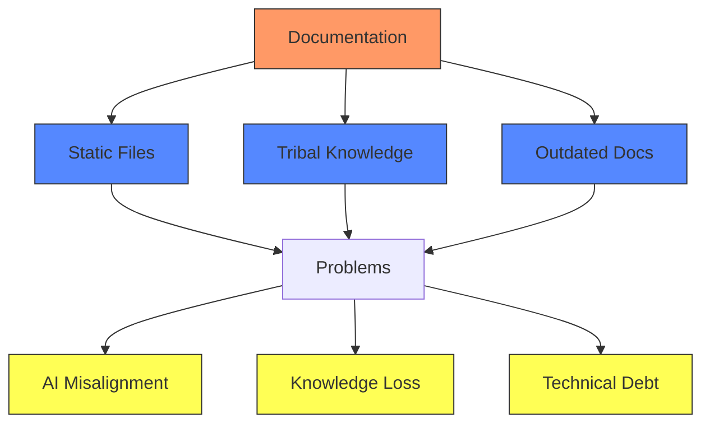

# The Real Impact: Why AI Brain Garden Matters

## The Enterprise AI Journey: A Story in Three Acts

### Act 1: The Promise

> "First day with the new AI pair programmer. Knocked out a Redux store implementation in 10 minutes. This is going to change everything!"
> — Senior Developer on Reddit

The initial excitement is universal. Teams see:
- Rapid code generation
- Quick wins on simple tasks
- Enthusiasm from developers
- Management buy-in
- Promises of 10x productivity

### Act 2: The Reality Check

> "Week 3: Found my junior dev committed an AI-generated authentication flow with three security vulnerabilities. This is getting dangerous."
> — Tech Lead on Reddit

> "Every time someone says 'AI told me to do this' as defense for a terrible design decision, I die a little inside."
> — Principal Engineer on Reddit

Reality sets in as teams discover:
- Security vulnerabilities in AI-generated code
- Inconsistent code quality
- Growing technical debt
- Review bottlenecks
- Team frustration

### Act 3: The Backlash

> "Month 2: Our velocity metrics look great, but technical debt is through the roof. Half my day is spent fixing AI-induced bugs that only surface in production."
> — Engineering Manager on Reddit

> "We've banned AI tools completely. The cleanup costs weren't worth the speed gains."
> — CTO on Reddit

The typical response:
- Restrict AI usage
- Add review gates
- Create rigid processes
- Return to old methods
- Miss opportunities

## The Core Problems

### 1. The Documentation Problem

> "AI keeps suggesting patterns that worked six months ago but we've since moved away from. There's no way for it to know about our architectural decisions."
> — Senior Architect on Reddit

### 2. The Testing Problem

> "We're generating code 100x faster but our test coverage is actually dropping. The AI generates tests, but they're often just happy path scenarios that miss critical edge cases."
> — QA Lead on Reddit

The testing crisis:
- Manual review can't keep up
- Missing edge cases
- False security
- Production issues
- Growing risk

### 3. The Knowledge Problem

> "Different team members use AI in completely different ways. There's no consistency, no shared learning, and we keep repeating the same mistakes."
> — Development Manager on Reddit

Knowledge gaps lead to:
- Inconsistent practices
- Repeated mistakes
- Lost insights
- Team friction
- Wasted effort

## How AI Brain Garden Addresses These Challenges

Having observed these common patterns of failure across the industry, I developed AI Brain Garden to systematically address each of these challenges. Here's how the system transforms the AI development experience:

### Documentation Evolution
Instead of static documentation that AI can't effectively use, AI Brain Garden creates a living knowledge system that:
- Captures architectural decisions in real-time
- Maintains context across the entire codebase
- Ensures AI suggestions align with current standards
- Prevents outdated pattern suggestions

### Intelligent Testing
Rather than relying on basic AI-generated tests, AI Brain Garden implements:
- Pattern-aware test generation
- Automated edge case detection
- Historical failure analysis
- Continuous test evolution

### Knowledge Integration
Instead of fragmented AI usage across teams, AI Brain Garden provides:
- Centralized learning from all interactions
- Consistent pattern application
- Shared best practices
- Automated knowledge capture

## The Real Difference

Through my work implementing these systems, I've observed:

1. **Development Velocity**
   - Features that once took days now complete in hours
   - Review time cut by more than half
   - Onboarding time significantly reduced

2. **Code Quality**
   - Dramatic reduction in AI-related bugs
   - Comprehensive test coverage
   - Consistent pattern application

3. **Team Dynamics**
   - Reduced friction in code reviews
   - Improved collaboration
   - Higher team confidence in AI tools

## The Path Forward

The future of enterprise development isn't about choosing between human expertise and AI power—it's about building systems that amplify both. AI Brain Garden doesn't just solve today's AI integration challenges; it creates a foundation for sustainable, high-quality development at scale.

The problems highlighted by developers across the industry are real, but they're not insurmountable. Through systematic approaches to knowledge management, testing, and team collaboration, we can transform AI from a potential liability into a true force multiplier for development teams.

The question now becomes: How do we implement this transformation in your organization? What role is needed to lead this change effectively? Let me share my vision for the Principal Engineer role—a position uniquely focused on turning these concepts and systems into reality while ensuring your team's success in the AI-enhanced development landscape. 