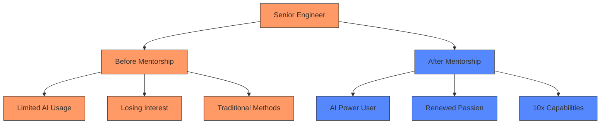
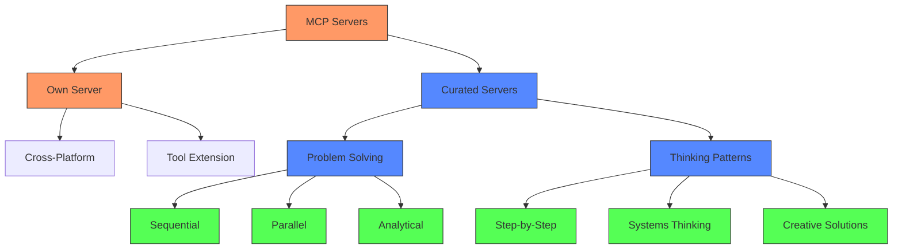
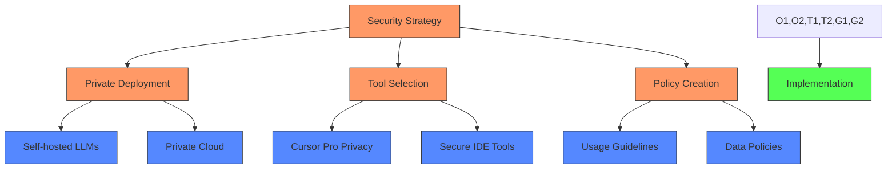
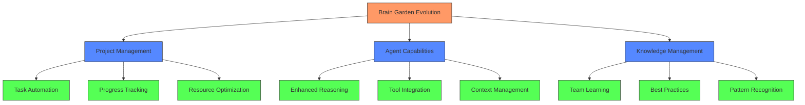
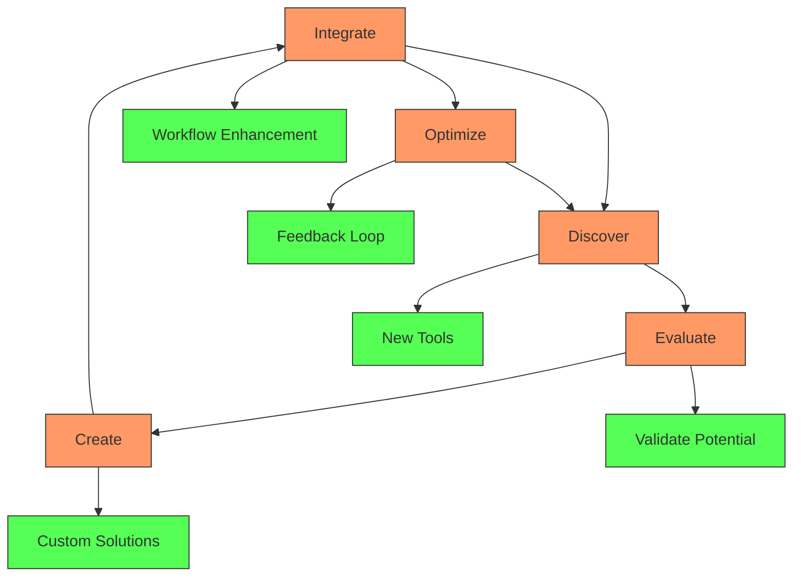
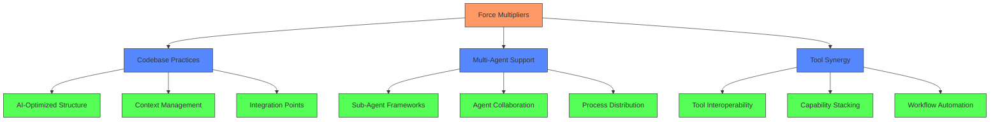
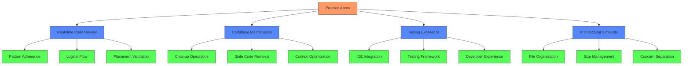

# Principal Engineer: AI Development Transformation

## The Need for Dedicated AI Leadership

Throughout my journey leading AI transformation, I've witnessed a fascinating pattern: while individual developers are eager to embrace AI tools, organizations struggle to create a coherent strategy for adoption. This isn't just about providing access to tools—it's about fundamentally transforming how teams work together in an AI-enhanced environment.

The transition to AI-assisted development creates a unique challenge: experienced developers need guidance to unlock AI's full potential, while organizations need leadership to navigate this transformation successfully.

### Current State of AI Adoption

1. **Individual Exploration**
   - Developers trying AI tools alone
   - Mixed results and experiences
   - No systematic approach
   - Limited knowledge sharing

2. **Organizational Uncertainty**
   - Lack of clear AI strategy
   - Resistance from some team members
   - Inconsistent adoption
   - Missing leadership buy-in

3. **Lost Potential**
   - Experienced developers feeling stagnant
   - Untapped AI capabilities
   - Inefficient learning curves
   - Missed opportunities for growth

4. **Knowledge Sharing Gaps**
   - Inconsistent tooling and practices
   - Individual developers "rolling their own" solutions
   - Duplicate effort across teams
   - Lost opportunities for collective improvement

5. **Team Coordination Challenges**
   - Unclear ownership of AI practices
   - Mixed adoption creating friction
   - Resistance creating "black boxes"
   - Inconsistent contribution to shared resources

6. **Security and IP Protection Concerns**
   - Uncertainty about data sharing with LLMs
   - Protection of proprietary code
   - Compliance requirements
   - Risk management needs

## Real Success Story: The Power of AI Mentorship

One of my most rewarding experiences was mentoring a senior engineer who had begun to lose his passion for coding. Through intensive one-on-one sessions, sharing my screen for hours at a time, I walked him through my approach to AI-assisted development. What started as simple prompting strategies evolved into a complete transformation of his development process.

The key wasn't just teaching him how to use AI tools—it was showing him how to think differently about development itself. We spent full days in Slack huddles, where I could guide him in real-time, suggesting different prompting strategies both within and outside the Brain Garden system. The result? Not only did his productivity skyrocket, but he rediscovered his enthusiasm for coding, telling me that these new capabilities had completely renewed his interest in development.

## The Knowledge Sharing Imperative

During my time leading AI transformation, I've encountered a critical challenge that often goes unaddressed: the balance between individual and team-wide AI practices. I've seen firsthand how different approaches to knowledge sharing can make or break a team's AI adoption. When I implemented shared cursor rules and knowledge files in our git repository, it immediately amplified the effectiveness of our AI tools across the team. However, this also revealed an important tension: while some team members embraced and contributed to these shared resources, others felt overwhelmed or resistant to change.

This experience taught me something crucial about AI transformation: it's not just about the tools or even the knowledge—it's about creating an environment where both can flourish while respecting different comfort levels and adoption rates.

## Technical Innovation: Beyond Basic AI Integration

My approach to AI transformation goes far beyond just adopting existing tools. Through hands-on experience with AI development, I identified critical gaps in the existing toolchain and created solutions to fill them. What started as personal productivity enhancements evolved into a comprehensive ecosystem that I've successfully shared with other developers.

### The Evolution of Prompt Forge

One of my first revelations was that the quality of AI responses often depends more on how you ask than what you ask. I found myself repeatedly refining prompts, turning simple instructions into detailed, contextual requests that yielded significantly better results. This led me to create Prompt Forge, a tool that manages and enhances prompts automatically.

For example, when a developer writes a basic prompt like "add error handling," Prompt Forge can automatically enhance it with specific requirements, edge cases, and best practices. I've seen this transform one-line requests into comprehensive instructions that consistently produce production-ready code. By making this tool available to my colleagues, they could immediately leverage my prompting expertise without having to learn all the nuances themselves.

### Browser Integration and Terminal Enhancement

Working extensively with AI agents, I realized they could be even more powerful with enhanced access to development tools. I forked the browser-use library and extended it with terminal capabilities, allowing agents to seamlessly handle debugging and testing tasks across environments. This wasn't just about automation—it was about creating a more natural workflow where AI could truly assist in complex development tasks.

### AI Context Generator: Bridging AI Platforms

One challenge I consistently encountered was the trade-off between different AI platforms. While Cursor's tight IDE integration is invaluable, there are times when you need the expanded context window of web-based LLMs like Gemini. This led me to develop the "AI Context Generator" VSCode extension.

This tool solves a critical workflow problem: how to efficiently share large codebases with web LLMs. With a single click, it generates both a structured filetree and a consolidated markdown view of an entire folder's contents. I built this after noticing developers struggling to manually copy-paste multiple files when they needed help with larger-scale refactoring or architecture questions.

What makes this tool particularly powerful is its ability to:
- Generate instant context for any folder in your project
- Create a clear, hierarchical view of your codebase
- Automatically format the output for optimal LLM consumption
- Enable seamless switching between different AI platforms
- Preserve code structure and relationships in the generated output

For example, when a developer needs to refactor a complex feature that spans multiple files, they can select the feature's directory, generate the context, and get comprehensive assistance from a web LLM without losing the structural context of how the files relate to each other. This bridges the gap between Cursor's precise file-level interactions and the broader context capabilities of web-based LLMs.

### Environment as a Force Multiplier

One of my most impactful insights was recognizing that the terminal environment itself could be a powerful force multiplier for AI assistance. I developed a TDD approach to environment setup, ensuring that every developer's machine provides the optimal context for AI collaboration. This includes:

- ZSH configuration that provides rich context to AI agents
- Terminal multiplexing for parallel processing
- Automated environment validation
- Enhanced prompt information reducing the need for additional commands

### Custom MCP Servers

My exploration of AI capabilities led me to both create and curate Model Context Protocol servers that dramatically extend what AI tools can do. I developed my own MCP server that can be installed into various environments including Cursor and Claude Desktop, but I also actively experiment with and recommend servers created by other developers. This collaborative approach to tool enhancement has been eye-opening – at this early stage of AI development, each new tool capability can fundamentally transform how agents solve problems.

One of my favorite examples is a server that implements different patterns of problem-solving and thinking. The sequential thinking pattern, for instance, enables any model to break down complex problems into discrete, manageable steps and then systematically address each one. This transforms how agents approach large-scale tasks, making them more methodical and thorough.

This ecosystem of MCP servers creates a powerful multiplier effect:
- My custom server provides core integration capabilities across different AI platforms
- Curated servers add specialized problem-solving approaches
- The combination enables agents to tackle complex tasks with sophisticated methodologies
- Teams can mix and match capabilities based on their specific needs
- The system grows more powerful as new tools and patterns are added

For example, when a developer needs to refactor a complex feature, the sequential thinking pattern helps break down the task into clear steps: analyzing dependencies, identifying risk areas, planning the refactor sequence, and executing changes safely. This structured approach, combined with the core capabilities of my MCP server, creates a more reliable and systematic development process.

These servers integrate seamlessly with Brain Garden and other tools, making AI assistance feel like a natural extension of the development environment. By actively curating and recommending helpful tools to developers, I help teams build their own optimal AI toolbox, tailored to their specific needs and workflows.

### Real-World Impact

These tools have transformed how my team works with AI. For instance, one developer using Prompt Forge was able to turn a simple feature request into a detailed specification that the AI could implement perfectly on the first try. Another used the enhanced browser integration to automate an entire test suite creation process that would have taken days to do manually.

The key to success has been making these tools available to team members in a way that matches their comfort level. Some developers started with basic prompt templates and gradually moved to more sophisticated features, while others immediately embraced the full capability set and began contributing their own enhancements.

## Principal Engineer Role: AI Transformation Focus

As a Principal Engineer, I would:

### 1. Direct Developer Mentorship
- Provide 1-on-1 AI development guidance
- Share proven prompting strategies
- Teach systematic AI approaches
- Build developer confidence
- Transform development practices

### 2. System Implementation
- Deploy AI Brain Garden system
- Integrate custom AI tools
- Create shared knowledge bases
- Establish best practices
- Enable team-wide adoption

### 3. Organizational Leadership
- Guide AI adoption strategy
- Address resistance constructively
- Build executive support
- Create success metrics
- Lead by example

### 4. Knowledge System Architecture
- Design team-wide knowledge sharing structures
- Establish rule management strategies
- Create contribution guidelines
- Balance team and individual tooling
- Prevent knowledge silos

### 5. Process Integration
- Define AI workflow standards
- Establish documentation practices
- Create testing protocols
- Set code ownership guidelines
- Enable cross-team collaboration

### 6. Technical Innovation
- Design and implement custom tools
- Enhance existing AI capabilities
- Create automated workflows
- Build development ecosystems
- Enable parallel processing
- Optimize development environments

## Breaking Down Barriers

One of the most challenging situations I've faced was when team members became protective of their code, treating it as a "black box" that others couldn't modify. This created a particular problem in an AI-enhanced environment, where our tools could help any team member quickly understand and modify any part of the codebase. I learned that successful AI transformation requires not just technical changes but a shift in how we think about code ownership and team collaboration.

Through careful mentorship and system design, I've found ways to help teams move past these barriers. It's about creating an environment where AI tools enhance rather than threaten individual contributions, where shared knowledge strengthens rather than diminishes personal expertise.

## Addressing Security and Privacy

One of the most critical aspects of AI transformation that organizations grapple with is the protection of their intellectual property and sensitive code. Through my experience, I've learned that these concerns need to be addressed head-on with a comprehensive strategy that balances security with productivity.

### Security-First Transformation

As part of my role, I would:

1. **Assess Security Requirements**
   - Evaluate sensitive code areas
   - Identify compliance needs
   - Map data flow patterns
   - Define security boundaries

2. **Develop Protection Strategies**
   - Configure privacy-focused tools
   - Implement secure workflows
   - Create usage guidelines
   - Establish monitoring systems

3. **Deploy Secure Solutions**
   - Self-hosted LLM options
   - Private cloud configurations
   - Cursor Pro privacy mode
   - Controlled environments

This isn't about limiting AI capabilities—it's about implementing them responsibly. I've found that having a clear security strategy actually accelerates adoption by giving teams confidence in their AI usage.

## The Path to Transformation

What I've learned through my experience is that successful AI transformation isn't a straight line—it's a journey that requires patience, understanding, and strategic thinking. When I see a team member go from skepticism to enthusiasm, or watch a previously siloed codebase become a collaborative space, I'm reminded that this transformation is about people as much as it is about technology.

## What I Bring to Your Team

As a Principal Engineer focused on AI transformation:

1. **Proven Mentorship Approach**
   - Successful track record of developer transformation
   - Established mentorship methodologies
   - Real-time guidance and support
   - Measurable developer growth

2. **Technical Leadership**
   - AI Brain Garden system implementation
   - Custom tool development
   - Knowledge system creation
   - Best practice establishment
   - Security-first architecture
   - Privacy-focused deployment

3. **Organizational Impact**
   - Strategic AI adoption guidance
   - Resistance management experience
   - Executive-level communication
   - Cultural transformation leadership

4. **Team Integration Expertise**
   - Experience managing mixed-adoption teams
   - Strategies for breaking down resistance
   - Methods for gradual integration
   - Approaches to shared ownership
   - Solutions for knowledge silos

5. **Custom Tool Development**
   - Prompt management systems
   - Environment optimization tools
   - Terminal enhancement suite
   - Browser integration framework
   - MCP server implementation
   - Parallel processing solutions

## Creating a Collaborative Future

The reality I've observed is that teams often split into AI adopters and traditional developers, creating an unintended divide in productivity and practices. I've successfully navigated this challenge by implementing graduated adoption strategies, where team members can contribute to and benefit from AI practices at their own pace while still maintaining team cohesion.

## Requirements for Success

### Organizational Commitment
- Executive-level support for AI transformation
- Openness to new development paradigms
- Investment in developer growth
- Long-term vision for AI integration

### Team Environment
- Developers interested in growth
- Space for experimentation
- Support for knowledge sharing
- Commitment to excellence

### Team Alignment
- Commitment to shared knowledge
- Openness to code sharing
- Willingness to contribute
- Agreement on AI practices
- Collaborative mindset

### Security Framework
- Clear data handling policies
- Protected IP strategies
- Compliance guidelines
- Risk management approach
- Security monitoring

### Technical Infrastructure
- Support for custom tool deployment
- Environment enhancement capabilities
- Integration flexibility
- Performance optimization
- Parallel processing support

## My Ideal Role: AI Innovation Lead

What excites me most about this role is the opportunity to push the boundaries of what's possible with AI-assisted development. I see my position as having three critical focuses that directly impact team productivity and innovation:

### 1. Brain Garden System Evolution

I'm deeply committed to continuing the development of the Brain Garden system. This isn't just about maintaining what exists—it's about:

- Expanding project management capabilities
- Developing new agent enhancement tools
- Creating more sophisticated knowledge management systems
- Building better integration points between tools
- Implementing advanced automation patterns

### 2. AI Technology Scout

The AI landscape evolves at an incredible pace, with game-changing tools emerging every few weeks. I see a critical part of my role as being the team's AI technology scout:

- Actively experimenting with new AI tools as they're released
- Evaluating their potential impact on development workflows
- Identifying integration opportunities with our existing systems
- Creating proof-of-concept implementations
- Developing best practices for tool adoption

This exploration is crucial because missing a significant AI advancement can mean falling behind on potential 10x productivity improvements. Having a dedicated explorer who can discover, vet, and integrate new tools ensures the team stays at the cutting edge of AI capabilities.

### 3. Custom Tool Development

I'm passionate about creating custom solutions that address our specific challenges:

- Building specialized VSCode extensions
- Forking and enhancing open-source libraries
- Developing custom MCP servers for unique use cases
- Creating team-specific development tools
- Implementing workflow automation solutions

These custom tools are vital because they're built with deep knowledge of our specific challenges and workflows. They bridge gaps that generic tools can't address and create competitive advantages through enhanced developer capabilities.

This continuous cycle of innovation, experimentation, and custom development creates a compounding effect: each new tool or enhancement builds upon our existing capabilities, creating an ever-more-powerful development environment.

### 4. AI Force Multiplier Architecture

A critical aspect of my role is identifying, implementing, and maintaining codebase practices that specifically enhance AI-driven development. This goes beyond traditional best practices—it's about creating and evolving an architecture that maximizes the potential of AI tools and frameworks.

This responsibility includes:

- **Evolving Architecture**
  - Implementing multi-sub-agent framework support
  - Designing systems for optimal AI interaction
  - Creating standardized integration points
  - Maintaining AI-friendly code organization

- **Capability Enhancement**
  - Identifying emerging AI force multipliers
  - Evaluating new tools like Claude Code
  - Integrating advanced MCP server capabilities
  - Implementing multi-agent processing systems

- **Team Enablement**
  - Creating setup guides for new capabilities
  - Maintaining documentation of AI best practices
  - Training team members on new frameworks
  - Monitoring and measuring effectiveness

- **Future-Proofing**
  - Anticipating upcoming AI advancements
  - Preparing codebase for new capabilities
  - Designing flexible integration points
  - Planning for scalability

For example, as multi-sub-agent frameworks become more robust, we need to ensure our codebase is structured to take full advantage of these capabilities. This might involve:
- Creating standardized communication channels between agents
- Implementing context-sharing mechanisms
- Designing workflow patterns for agent collaboration
- Building monitoring and debugging tools for multi-agent processes

This focus on force multipliers creates a compounding effect: each new capability we implement makes future integrations easier and more powerful, while simultaneously making our developers more effective.

### AI-Optimized Development Practices

My experience with AI-assisted development has taught me that the role of a Principal Engineer evolves to focus heavily on maintaining an environment where both human developers and AI agents can work efficiently. This involves a set of practices I've developed and refined:

#### 1. Real-time AI Generation Oversight
I actively monitor AI code generation, focusing on:
- Immediate validation of code placement and architectural fit
- Ensuring adherence to established codebase patterns
- Verifying the logical approach to problem-solving
- Early intervention when generation needs course correction
- Providing clear, specific guidance for reprompting

#### 2. Proactive Codebase Maintenance
I maintain codebase clarity through:
- Regular cleanup of accidentally generated artifacts
- Using AI to identify and remove stale code
- Optimizing context space for AI comprehension
- Ensuring generated code integrates cleanly
- Maintaining clear boundaries between components

#### 3. Developer Tooling Excellence
I focus on maintaining robust development infrastructure:
- Keeping TypeScript configurations optimized
- Ensuring ESLint rules enhance productivity
- Maintaining comprehensive automated testing
- Optimizing IDE integration and experience
- Streamlining the development workflow

#### 4. Architecture of Simplicity
I enforce architectural principles that benefit both human and AI developers:
- Maintaining files under 500 lines for optimal comprehension
- Ensuring clear file naming and logical organization
- Separating concerns for better maintainability
- Refactoring complex files into manageable components
- Creating intuitive project structure

This approach creates a virtuous cycle: as the codebase becomes more organized and maintainable, both AI and human developers become more effective. For example, when a file exceeds 1,500 lines and combines multiple concerns, it not only makes human comprehension more difficult but also forces AI agents to waste context space processing irrelevant code. By maintaining these standards, we achieve:

- Faster AI comprehension and generation
- Reduced errors in AI-generated code
- Better human understanding and maintenance
- Improved development velocity
- More reliable and regression-resistant codebase

My role becomes increasingly focused on high-level architecture and system efficiency, ensuring that both human and AI developers can work effectively. I proactively identify and address architectural patterns that might lead to confusion or mistakes, maintaining a clean and efficient development environment that supports optimal velocity while ensuring reliability.

## A Vision for Growth

I'm excited about the possibility of joining your team as a Principal Engineer focused on AI transformation. Let's discuss:

1. Your team's AI adoption goals
2. Current developer experiences with AI
3. Organizational readiness for transformation
4. How my mentorship approach can help

The future of development is AI-assisted, and with the right leadership and mentorship, your team can fully embrace this new paradigm.

[Contact Information] 