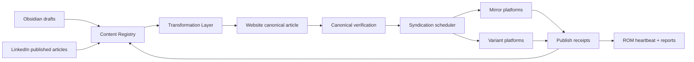

# Content Distribution Factory Design

## Purpose

Design a programmatic publishing system that moves David's ideas from Obsidian and LinkedIn into a canonical website blog, then distributes approved mirrors or variants to external platforms.

The goal is not to spam every site with identical copies. The goal is to make davidmieloch.com the durable SEO and AI-indexing home while using other platforms for reach, audience fit, and discovery.

## Source Of Truth Model

Current transition state:

- LinkedIn articles are the source of truth for what has already been publicly published.
- Obsidian is the source for drafts, notes, images, and unpublished work.
- davidmieloch.com should become the canonical home for durable articles going forward.

Target state:

- Website canonical article publishes first.
- LinkedIn gets a platform-native article or post variant that links back.
- Other platforms receive either delayed mirrors or tailored variants.
- A registry records every platform receipt and reconciles drift.

## Mirrors vs Variants

Do not post identical mirrors everywhere by default.

Use mirrors when:

- The platform supports canonical URLs or clear backlinks.
- The article is durable and search-oriented.
- Delay can protect the website as the canonical source.

Use variants when:

- The platform rewards native tone or shorter form.
- The content should become a thread, excerpt, newsletter intro, or opinionated summary.
- The platform does not preserve canonical metadata well.

Recommended platform strategy:

- Website: canonical SEO home.
- LinkedIn: current published-state reconciliation; later, website-first excerpts and native article variants.
- Medium / Dev.to / Hashnode / DZone / HackerNoon: delayed mirrors or lightly edited variants with canonical/backlink policy.
- Substack: newsletter framing, not a pure mirror unless the article is essay-first.
- X / Bluesky / Threads: short variants and hooks, not mirrors.

## Core Modules

### Content Registry

Single source for content state.

Fields:

- `contentId`
- `slug`
- `title`
- `canonicalUrl`
- `sourcePath`
- `linkedinSourceUrl`
- `status`: `draft | approved | website_published | syndicated | archived`
- `era`: `current | transitional | legacy`
- `platformTargets`
- `publishHistory`
- `assetManifest`

### Ingestion Adapters

Adapters read source systems into normalized records.

- `obsidianReader`: scans the vault for approved draft folders.
- `linkedinReader`: reconciles already-published articles.
- `websiteReader`: verifies canonical website state.

Adapters should start read-only except the website writer.

### Transformation Layer

Transforms one article into platform outputs:

- canonical website markdown
- LinkedIn variant
- mirror markdown
- excerpt/social post
- image manifest

The transformation layer owns formatting and platform-specific constraints. Platform clients should not rewrite content.

### Platform Clients

Each platform gets its own bounded client:

- `websitePublisher`
- `linkedinPublisher`
- `mediumPublisher`
- `devtoPublisher`
- `hashnodePublisher`
- `substackPublisher`

Initial clients should support `draft` and `validate` before `publish`.

### Scheduler

Responsible for timing, retries, and approval gates.

Default policy:

1. Website publish.
2. Verify canonical URL, metadata, sitemap, RSS.
3. Wait `1-7 days`.
4. Publish approved mirrors/variants.
5. Reconcile receipts daily.

### Observability

Every pipeline run writes:

- command run
- input checksum
- output checksum
- target platform
- publish receipt or failure
- canonical URL
- fallback state

Observers:

- local ROM heartbeat JSONL
- registry status report
- website synthetic check
- platform receipt check

Fallback:

- If platform automation fails, emit a manual-post package with exact copy, images, links, and checklist.

## Data Flow



## Authentication Boundaries

Do not make browser-login automation the core system.

Rules:

- Use official APIs where available.
- Keep one credential per platform.
- Store credentials outside the repo.
- Prefer draft creation over direct publish until a platform has passed multiple observed runs.
- Require human approval before first external publish on each platform.
- Browser automation is allowed for setup and manual fallback, but not as the primary long-term publishing substrate.

This is where the earlier browser attempt failed: using the browser directly as the publishing system is brittle. The durable approach is an adapter pipeline with browser-assisted setup only where APIs do not exist.

## Vault Organization

Recommended structure:

```text
blogs/
  _registry/
    content-registry.json
    platform-ledger.json
  drafts/
    <slug>/
      index.md
      images/
  approved/
    <slug>/
      index.md
      images/
  published/
    <slug>/
      index.md
      images/
      variants/
  legacy/
    <slug>/
      index.md
      images/
```

Images live beside each article first. Website import can copy them into `public/blog/<slug>/images`.

## Build Phases

### Phase 1: Registry And Reconciliation

- Read LinkedIn published state.
- Read Obsidian drafts.
- Generate a registry report.
- No external posting.

### Phase 2: Website Canonical Publishing

- Import approved Obsidian article to website content.
- Copy images.
- Validate frontmatter, RSS, sitemap, and canonical metadata.
- Publish to staging first.

### Phase 3: Manual Syndication Packages

- Generate platform-specific markdown/copy packages.
- Include image assets and checklist.
- Human posts or approves browser-assisted draft creation.

### Phase 4: Platform Draft Automation

- Use APIs to create drafts where possible.
- Record receipts.
- Keep direct publish behind per-platform approval.

### Phase 5: Scheduled Publishing

- Add scheduled jobs only after draft automation is reliable.
- Daily reconciliation and weekly drift reports.

## Risks

- SEO duplication from careless mirrors.
- Platform auth expiry.
- Platform API changes.
- Wrong content variant posted to the wrong audience.
- Silent drift between LinkedIn, Obsidian, website, and external platforms.
- Overengineering the schema until writing slows down.

## Acceptance Criteria

- A registry report can answer what exists in Obsidian, LinkedIn, and the website.
- One approved article can publish to the website with images and canonical metadata.
- One manual syndication package can be generated for at least three platforms.
- No external platform direct-publish occurs without human approval.
- Every run writes observability artifacts and a Forgejo-linked summary.

## PIE-CI Review

### P — Purpose
Score: ✅
Notes: This spec owns one concern: the content distribution pipeline.

### I — Interface
Score: ✅
Notes: Interfaces are the registry, adapters, transformer, scheduler, and receipts.

### E — Encapsulation
Score: ✅
Notes: Platform clients own platform details; transforms do not leak credential or browser concerns.

### C — Connection
Score: ✅
Notes: Connections are explicit and staged. Browser automation is a fallback, not a core dependency.

### I — Implementation
Score: ✅
Notes: The plan starts with read-only reconciliation and manual packages before direct external publishing.

## Merge Decision

Pass

## Required Fixes

None.

## Core Judgment

Does this reduce the surface area of the next change?

Answer: Yes. It separates content state, transformation, publishing, scheduling, and observability into clear modules.
