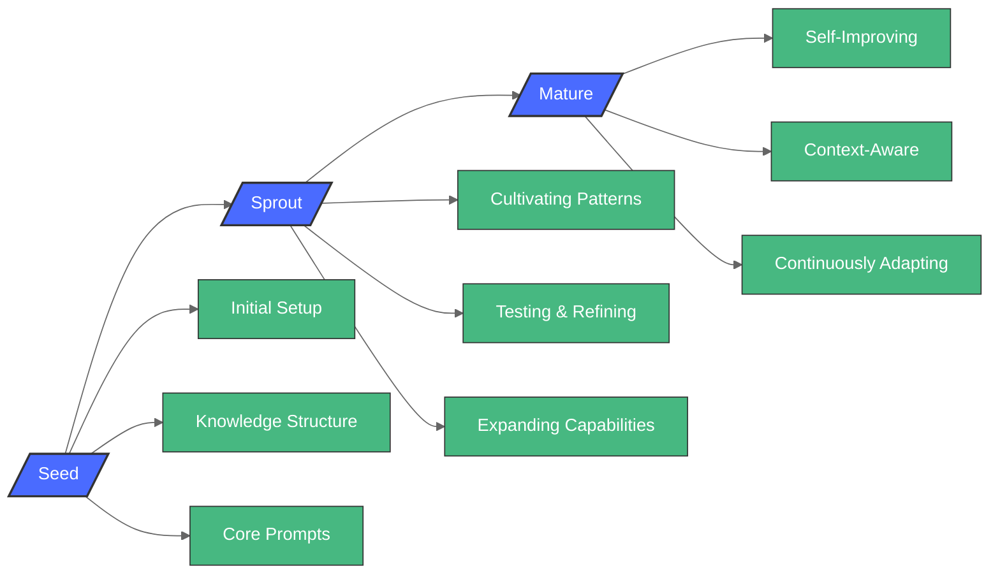

# Garden Metaphor Diagram Migration

## Source Information
- **Component**: `src/shared-components/sections/BrainGardenOverview/components/GardenMetaphorSection/GardenMetaphorSection.tsx`
- **Definition**: `GARDEN_METAPHOR_DIAGRAM` (defined in component)
- **Line**: ~70
- **Usage**: Diagram showing the three phases of a Brain Garden project's growth

## Diagram Definition

## Migration Tasks
- [x] Create new `GardenMetaphorDiagram` component in `src/shared-components/Diagrams/GardenMetaphorDiagram/`
- [x] Implement ReactFlow nodes and edges based on the Mermaid diagram above
- [x] Ensure consistent styling with the AiIntegrationFlowDiagram
- [x] Add appropriate stories for the component
- [ ] Update the `GardenMetaphorSection` component to use the new diagram component
- [ ] Test the diagram's appearance in all supported themes
- [ ] Remove Mermaid dependency if no longer used elsewhere

## Additional Notes
- This diagram uses a horizontal layout (LR) like the CoreComponentsDiagram
- The diagram has custom theme variables for specific coloring
- Uses special node shapes (Seed, Sprout, and Mature nodes use the slash-node syntax)
- Background should be transparent to fit within the green background in the component 

## Implementation
- The ReactFlow implementation uses the `capsule` node type for the phase nodes (Seed, Sprout, Mature)
- Standard node types are used for the aspect nodes, styled with green background to match the Mermaid styling
- Custom positioning is used to create a visually appealing layout
- The diagram is designed to work with a transparent background to match the original green section background 