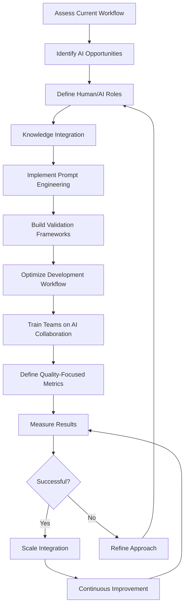

# AI Autopilot Analogy Diagram Migration

## Source Information
- **Component**: `src/shared-components/sections/AiAutopilotAnalogy/AiAutopilotAnalogy.tsx`
- **Prop**: `mermaidDiagramProps.definition`
- **Line**: ~560
- **Usage**: AI Integration Process Flow diagram showing the workflow for integrating AI into development

## Default Diagram Definition
Found in `src/shared-components/sections/AiAutopilotAnalogy/AiAutopilotAnalogy.logic.tsx`:

## Migration Tasks
- [x] Create new `AiIntegrationProcessDiagram` component in `src/shared-components/diagrams/AiIntegrationProcessDiagram/`
- [x] Implement ReactFlow nodes and edges based on the Mermaid diagram above
- [x] Ensure consistent styling with the AiIntegrationFlowDiagram
- [x] Add appropriate stories for the component
- [x] Update the `AiAutopilotAnalogy` component to use the new diagram component
- [x] Test the diagram's appearance in all supported themes
- [ ] Remove Mermaid dependency if no longer used elsewhere

## Additional Notes
- The component should be centered with a max-width of 800px
- Should support theme prop
- Needs to be responsive with height="auto" and width="100%" 