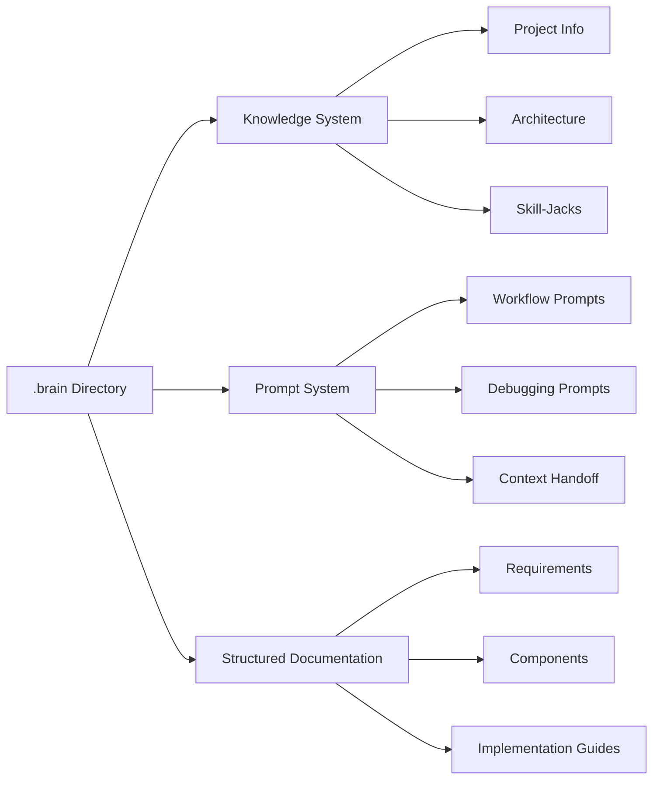

# Core Components Diagram Migration

## Source Information
- **Component**: `src/shared-components/sections/BrainGardenOverview/components/CoreComponentsSection/CoreComponentsSection.tsx`
- **Definition**: `DEFAULT_DIAGRAM` (defined in component)
- **Line**: ~93
- **Usage**: Diagram showing the Brain Garden architecture with three main components

## Diagram Definition

## Migration Tasks
- [ ] Create new `BrainGardenComponentsDiagram` component in `src/shared-components/diagrams/BrainGardenComponentsDiagram/`
- [ ] Implement ReactFlow nodes and edges based on the Mermaid diagram above
- [ ] Ensure consistent styling with the AiIntegrationFlowDiagram
- [ ] Add appropriate stories for the component
- [ ] Update the `CoreComponentsSection` component to use the new diagram component
- [ ] Test the diagram's appearance in all supported themes
- [ ] Remove Mermaid dependency if no longer used elsewhere

## Additional Notes
- This diagram uses a horizontal layout (LR) instead of the typical top-down layout
- Background is transparent
- Should maintain responsive width and height 