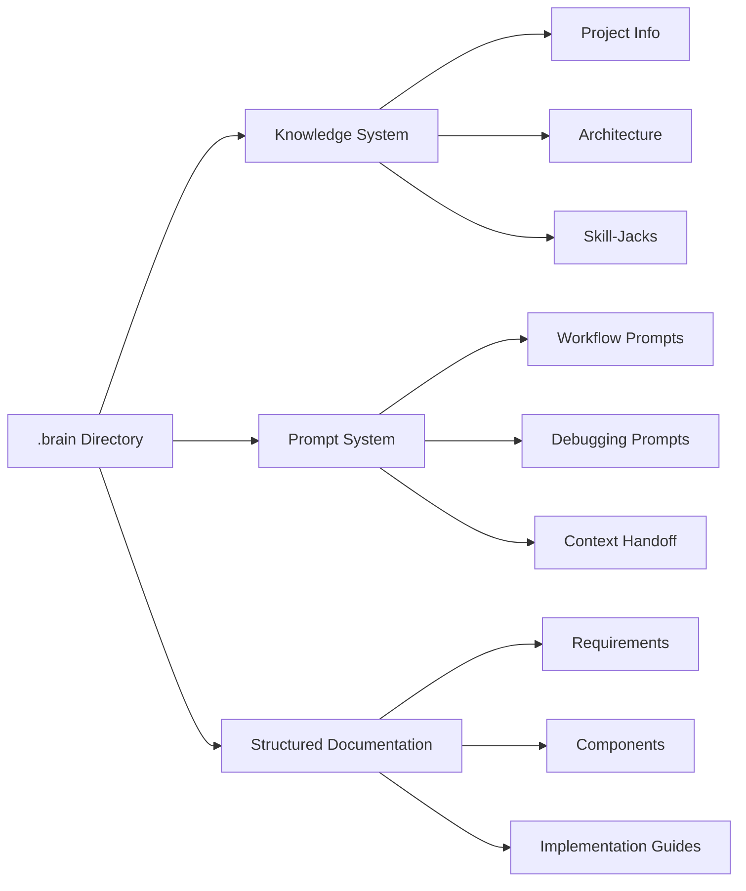

# Brain Garden Components Diagram Migration

## Original Mermaid Diagram 

## Migration Status

- [x] Create new `BrainGardenComponentsDiagram` component in `src/shared-components/diagrams/BrainGardenComponentsDiagram/`
- [x] Implement the diagram using ReactFlow
- [x] Add Storybook stories for the component
- [x] Update the CoreComponentsSection to use the new diagram component

## Modifications Made

- Created a ReactFlow version of the diagram
- Added proper icons to enhance visual representation
- Implemented theme support (default, dark, forest, neutral)
- Adjusted node positions for better layout
- Added validation to prevent rendering errors
- Updated CoreComponentsSection to use the new ReactFlow diagram
- Kept dynamic import pattern for better performance

## Next Steps

1. ✅ Replace the Mermaid diagram in CoreComponentsSection with the new ReactFlow component
2. Test the new component in the application
3. Update any other instances of this diagram

## Implementation Details

- The component maintains the same structure as the original Mermaid diagram
- Component defines nodes for:
  - Main node (.brain Directory)
  - Core Components (Knowledge System, Prompt System, Structured Documentation)
  - Detail nodes for each component (3 nodes each)
- Uses custom node styling with improved visual hierarchy
- Uses the shared ReactFlowDiagram component as base 